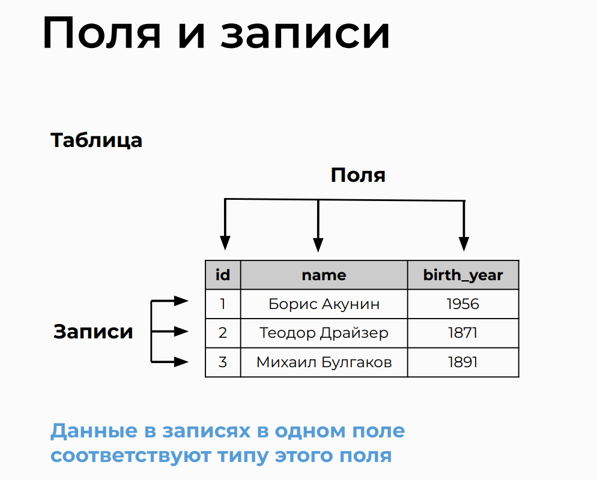
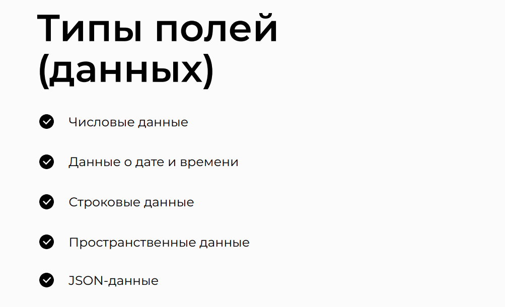
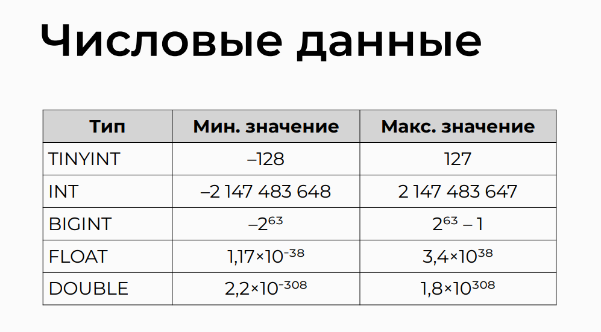
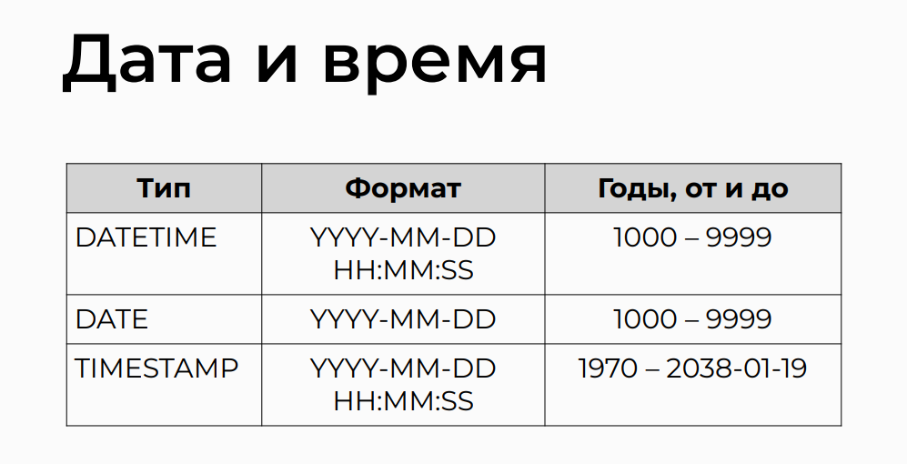
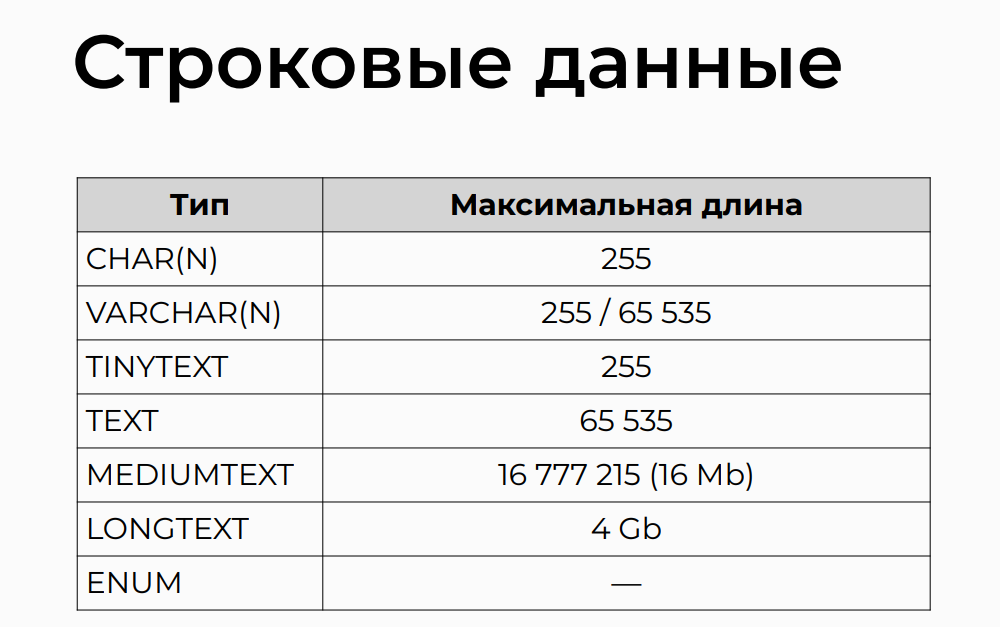
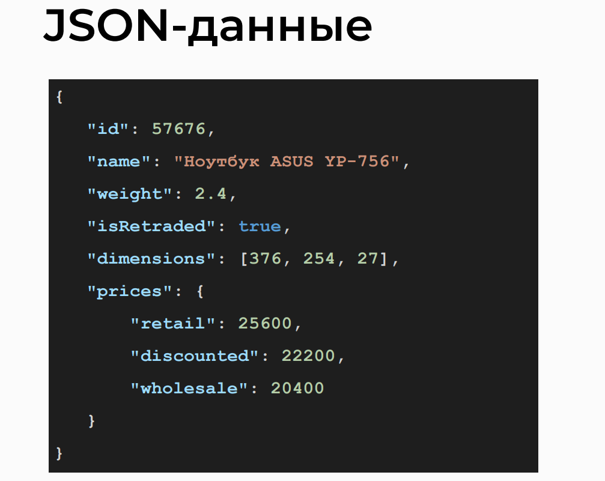
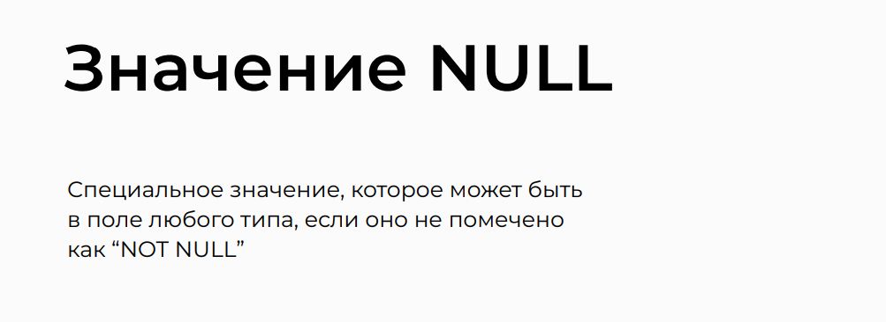

# Types of fields in relational databases

## Fields and Records
> Explore the concepts of fields and records in database management.

## Types of Fields (Data)
> Learn about different types of fields and data.

> Learn about different types of fields and data.

## Data Types
> Understanding how data types is handled in databases.

## Numeric Data
> Understanding how numeric data is handled in databases.

## Date and Time Data
> Exploration of data types related to dates and times.

## String Data
> Insight into the handling of string data in databases.

## JSON Data
> Understanding the use of JSON data in databases.

## NULL Value
> Exploration of the concept and usage of NULL values in databases.

## Description
> Additional Materials:

- [Documentation on Data Types (MySQL)](https://dev.mysql.com/doc/refman/8.0/en/data-types.html)
- [Documentation on Data Types (PostgreSQL)](https://www.postgresql.org/docs/9.5/datatype.html)

