# Types of relationships in relational databases
> Explore the concept of relationships between tables in a database.

## Table Relationships
> Understand the relationship in database modeling.

>

## One-to-Many Relationship
> Examine the relationship type "one-to-many" in database modeling.

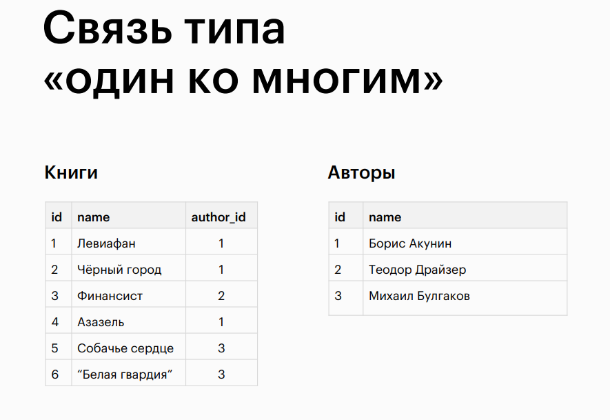

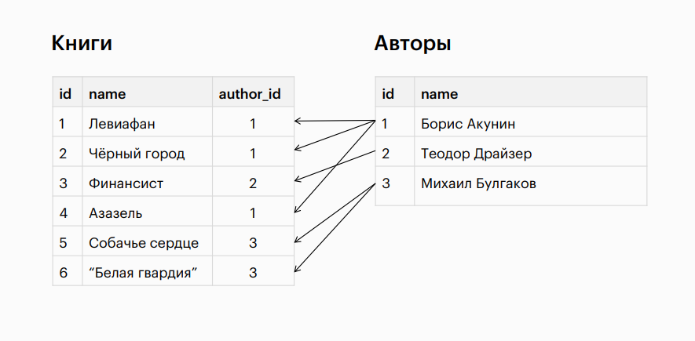

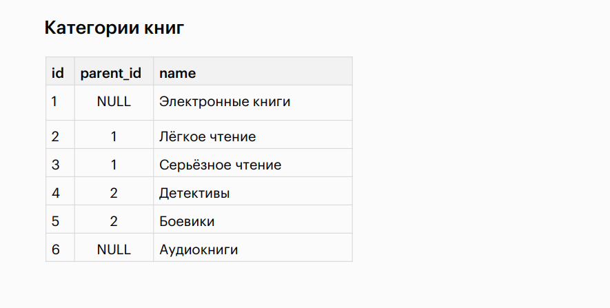

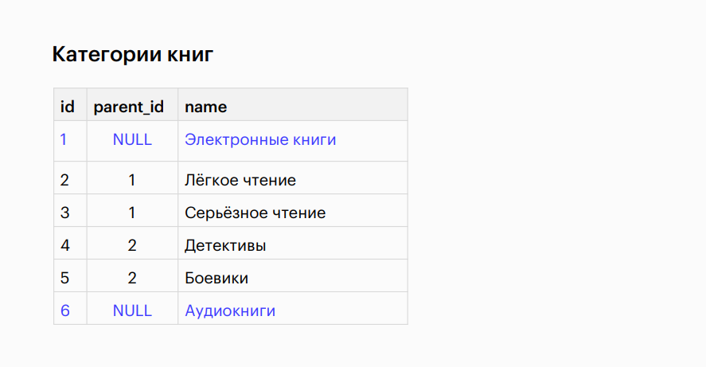

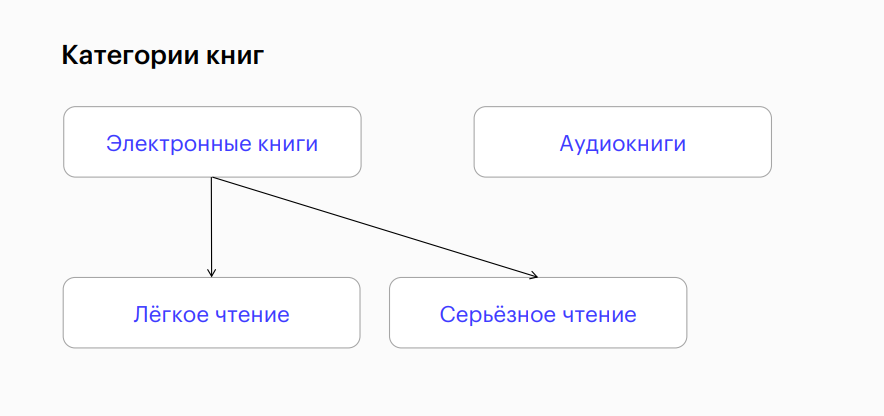

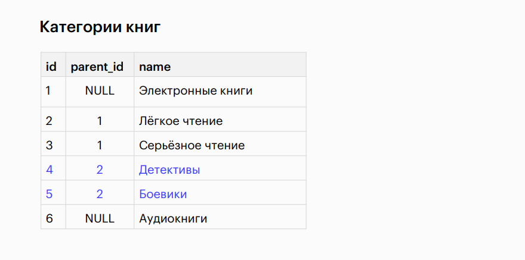

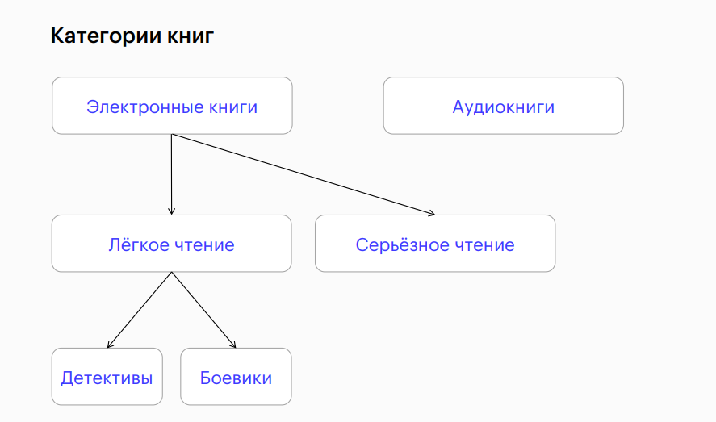

## One-to-One Relationship
> Explore the relationship type "one-to-one" in database modeling.

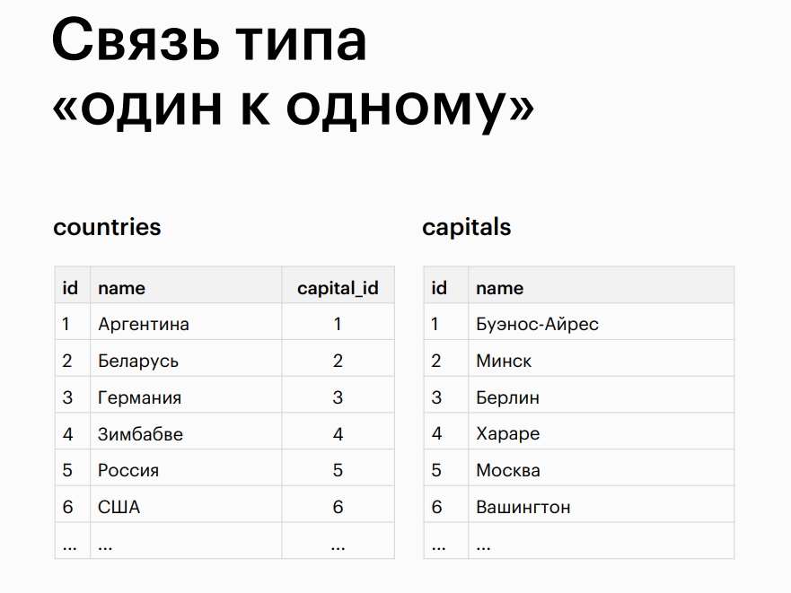

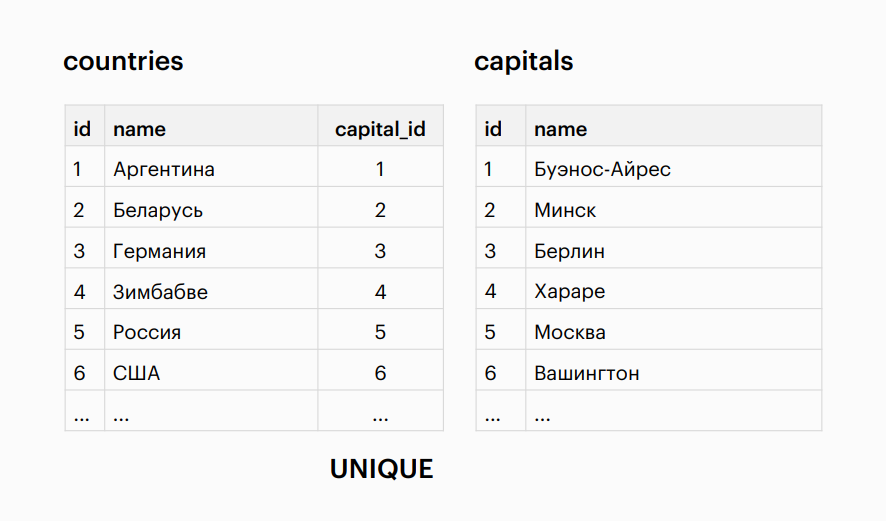

## Many-to-Many Relationship
> Explore the relationship type "many-to-many" in database modeling.

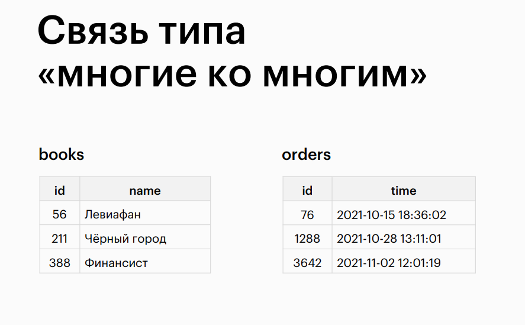

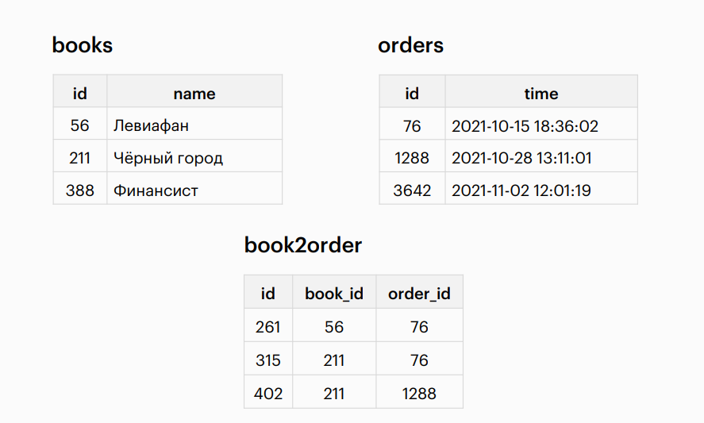

## Conclusion
> Summary and concluding remarks.

