# SQL Structured Query Language

## Relational and non-relational databases

## Concept of a Database
> Explore the fundamental concept of a database.

## Types of Databases
> Learn about different types of databases.

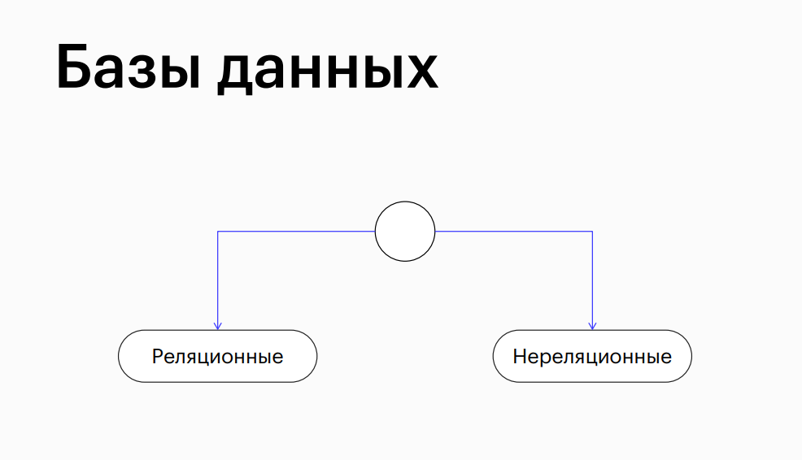

## Relational Databases
> Understand the principles of relational databases.

## Example: Online Bookstore
> Illustration of concepts using an example of an online bookstore.

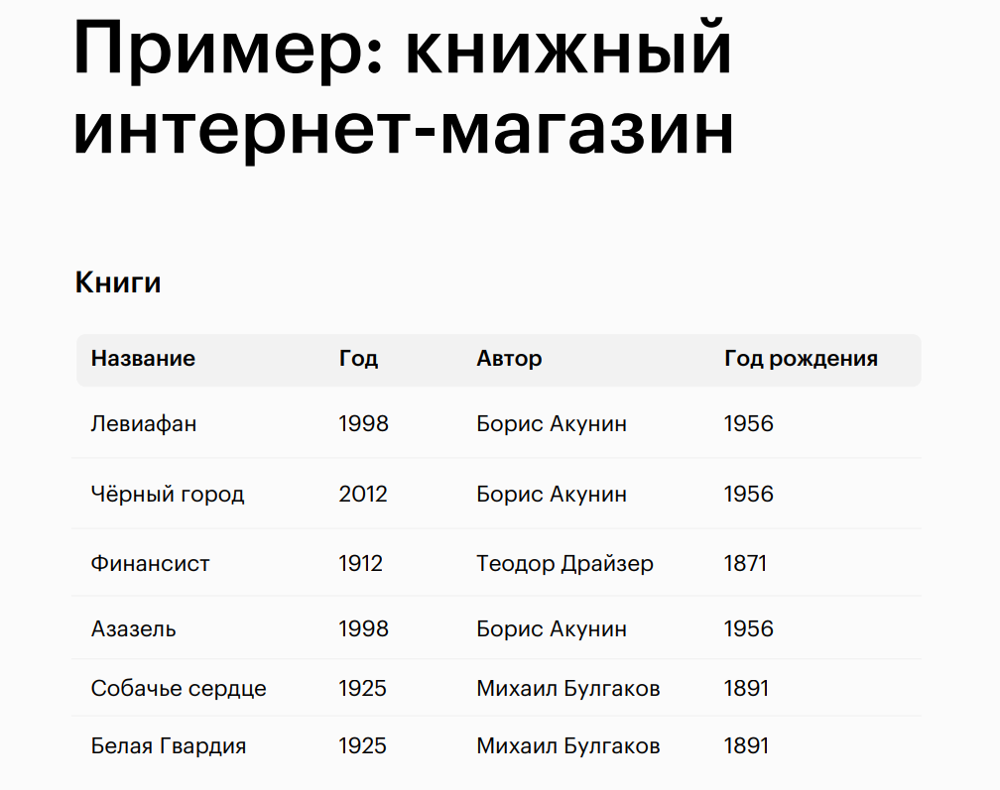

## Example: an online bookstore

## Problems

## Example: an online bookstore
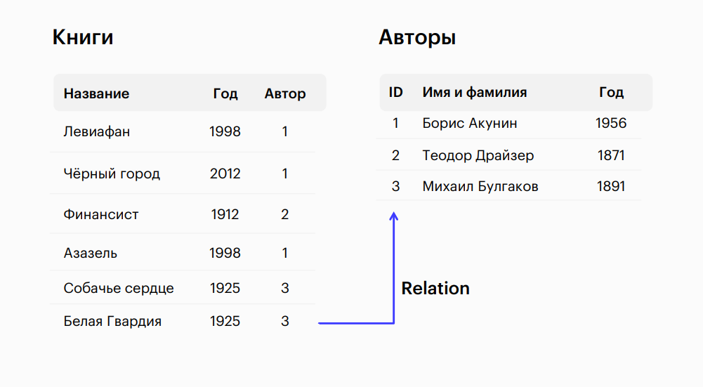

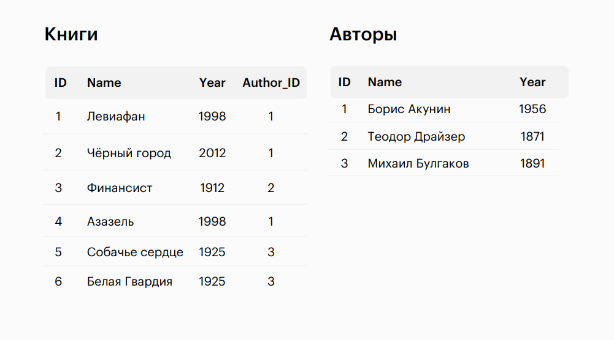

## Terminology
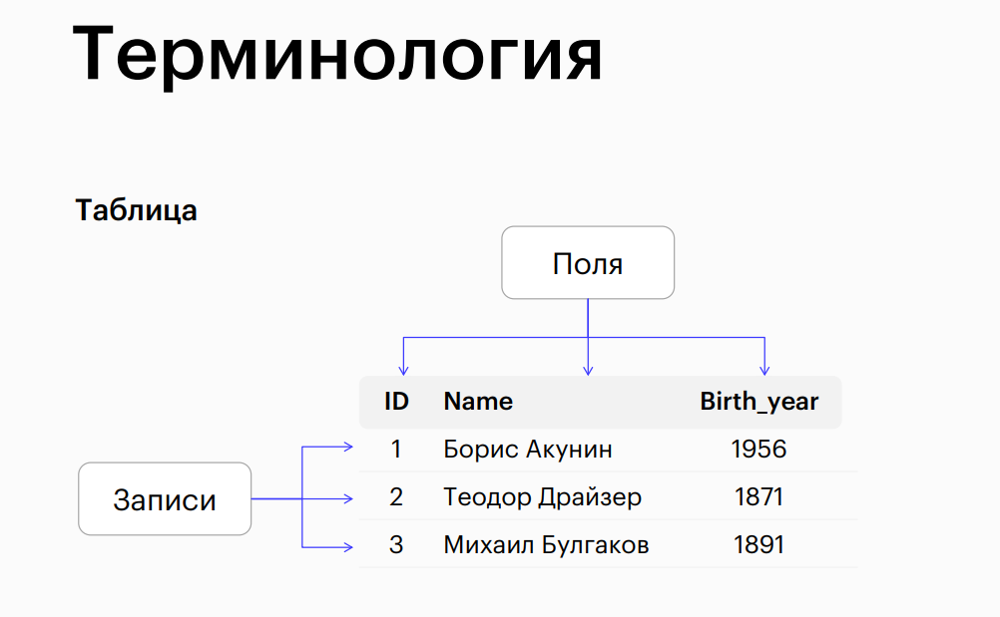
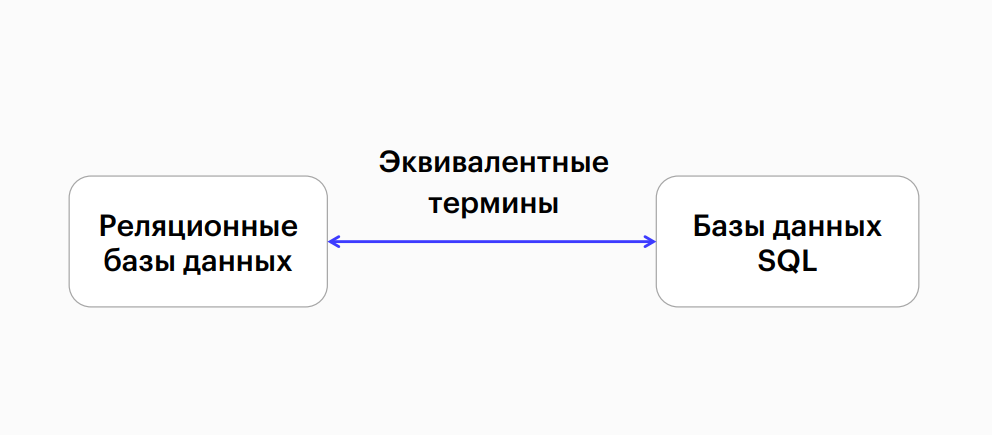

## SQL Query Language
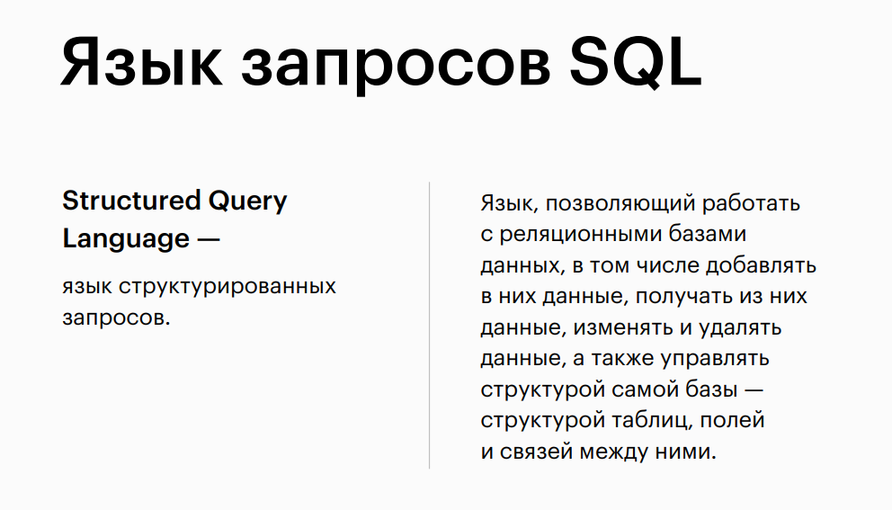

## Relational databases
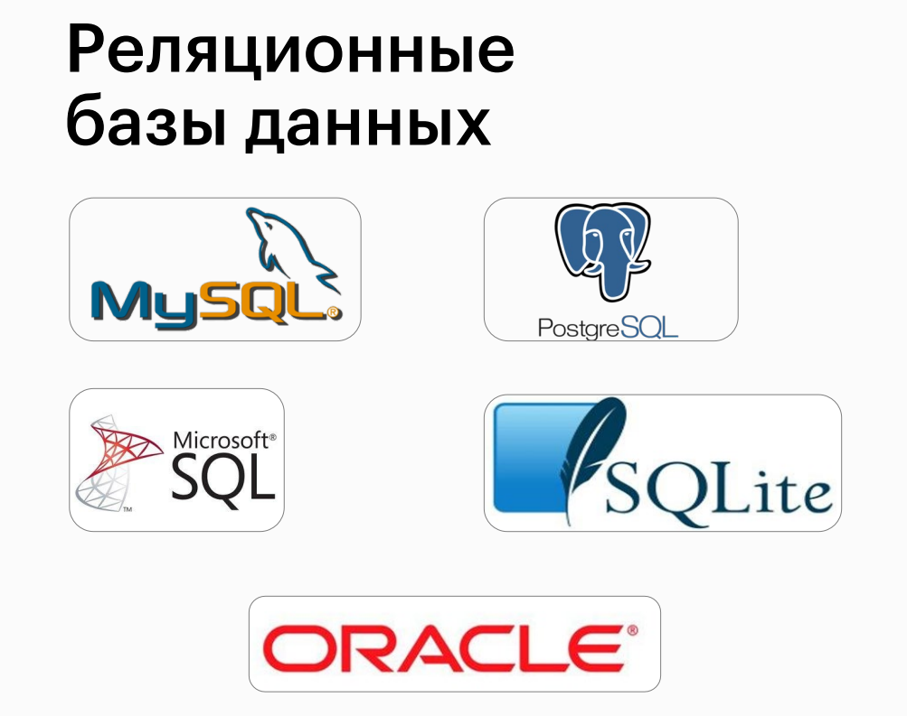

## Non-relational databases (NoSQL)

## Formats for storing data in NoSQL databases
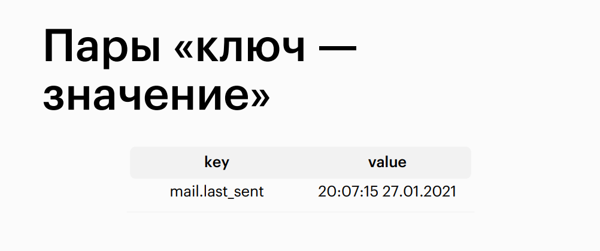

## Formats for storing data in NoSQL databases
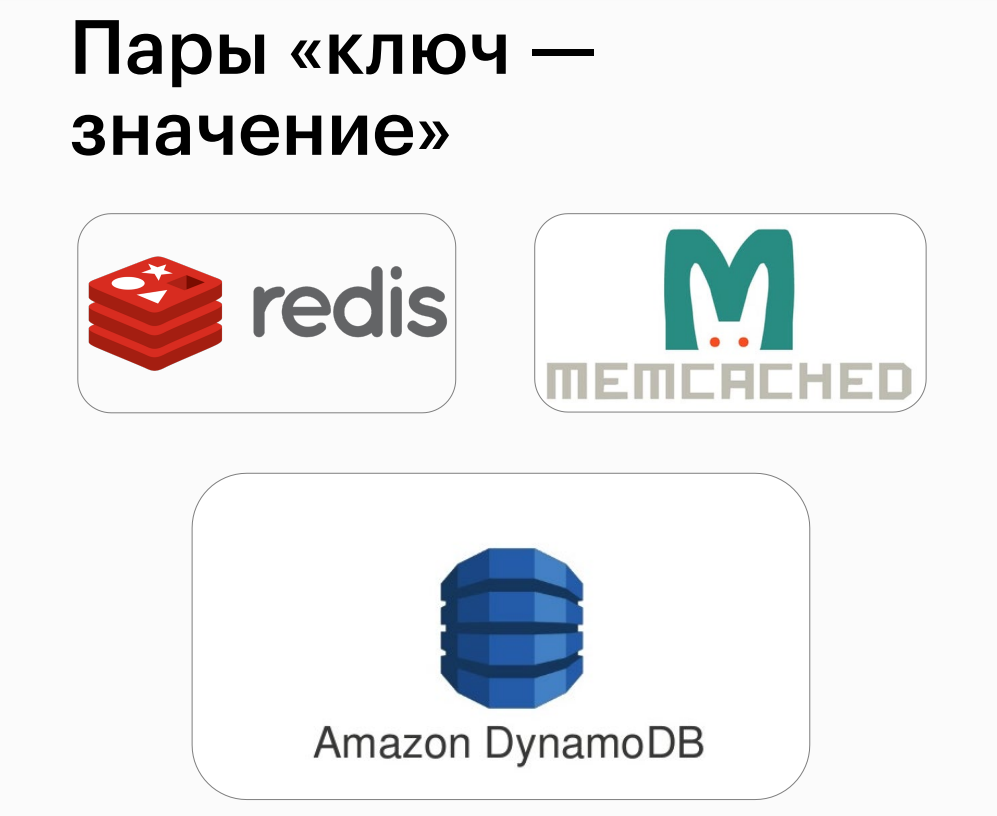

## Key—value pairs
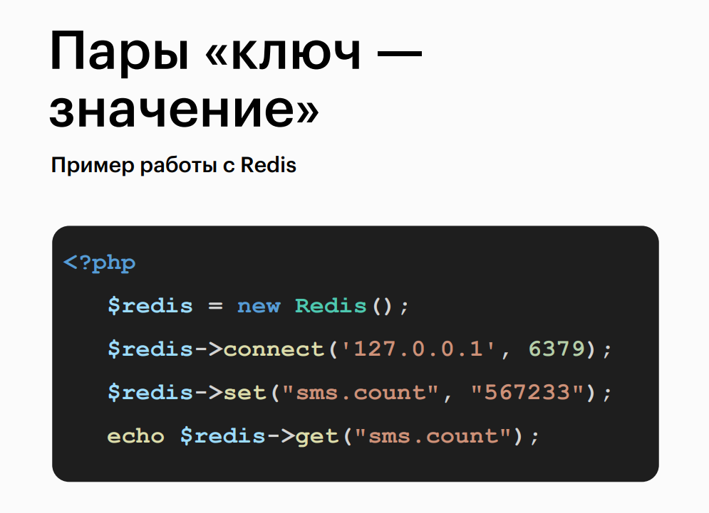

## Formats for storing data in NoSQL databases

## JSON documents
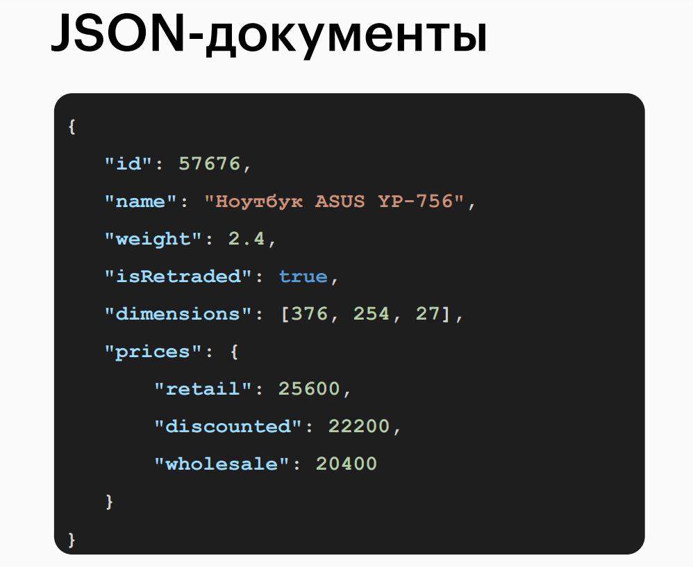

## Document-oriented databases
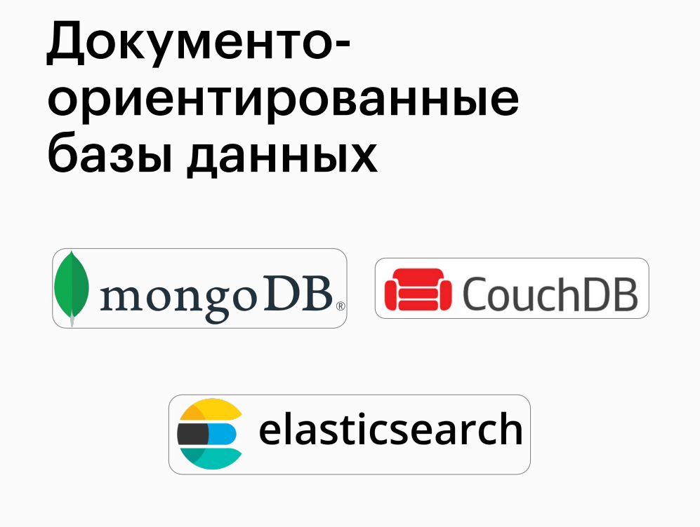

## Formats for storing data in NoSQL databases
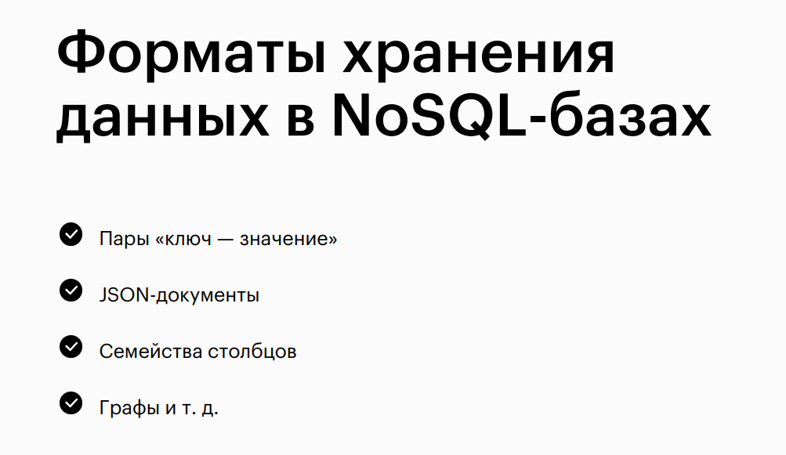

Happy querying! 🚀
