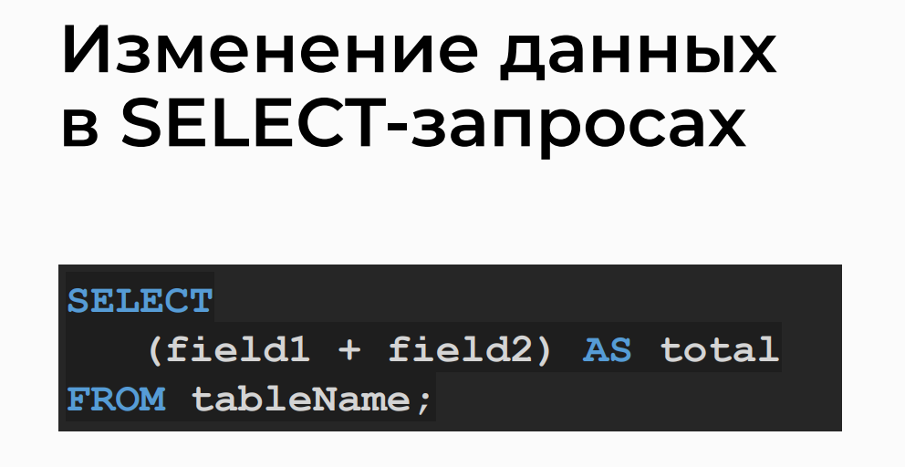

# SELECT Query

## Simple SELECT Query Syntax
> The syntax of a basic SELECT query.


## Displaying Individual Fields of a Table
Exploring how to output specific fields of a table.


## Modifying Field Names in Queries
Changing the names of fields in queries.


## Modifying Data in a SELECT Query
Making changes to data within a SELECT query.



## Queries

>- Selects all columns from the 'good' table
```sql
SELECT * FROM `good` WHERE 1;
```

>- Selects the 'name' and 'price' columns from the 'good' table
```sql
SELECT `name`, `price` FROM `good` WHERE 1;
```

>- Selects the 'category_id' column as 'productCategory' and the 'name' column as 'productName' from the 'good' table
```sql
SELECT `category_id` AS productCategory, `name` AS productName FROM `good` WHERE 1;
```

>- Selects the 'name' column and calculates the product of 'count' and 'price' columns as 'totalCost' from the 'good' table
```sql
SELECT `name`, (`count` * `price`) AS `totalCost` FROM `good` WHERE 1;
```

>- Selects the 'name' column and calculates the product of 'count' and 'price' columns as 'totalCost' from the 'good' table, ordered by 'totalCost' in ascending order
```sql
SELECT `name`, (`count` * `price`) AS `totalCost` FROM `good` WHERE 1 ORDER BY `totalCost` ASC;
```

>- Selects the 'name' column and calculates the product of 'count' and 'price' columns as 'totalCost' from the 'good' table, ordered by 'totalCost' in descending order
```sql
SELECT `name`, (`count` * `price`) AS `totalCost` FROM `good` WHERE 1 ORDER BY `totalCost` DESC;
```

Happy querying!
