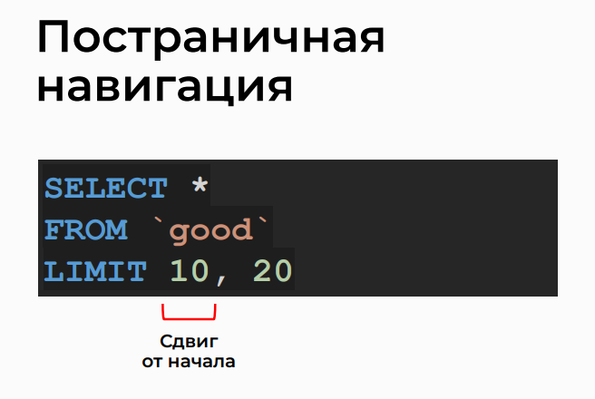

# Sorting And Limiting The Number Of Results

## Topic


## Sorting in Ascending Order


## Sorting in Descending Order


## Multiple Sorting


## Limiting the Number of Records


## Record with a Small Value


## Paginated navigation



## Analysis of Query Variations in phpMyAdmin

>- Select all records from the 'good' table
```sql
SELECT * FROM `good`;
```
>- Select all records from the 'good' table and order them by 'category_id' in ascending order
```sql
SELECT * FROM `good` ORDER BY `category_id`;
```
>- Select all records from the 'good' table and order them by 'id' in ascending order and 'name' in ascending order
```sql
SELECT * FROM `good` ORDER BY `id`, `name`;
```
>- Select all records from the 'good' table and order them by 'name' in descending order
```sql
SELECT * FROM `good` ORDER BY `good`.`name` DESC;
```
>- Select all records from the 'good' table and order them by 'name' in ascending order
```sql
SELECT * FROM `good` ORDER BY `good`.`name` ASC;
```
>- Select all records from the 'good' table and order them by 'id' in ascending order
```sql
SELECT * FROM `good` ORDER BY `good`.`id` ASC;
```
>- Select all records from the 'good' table and order them by 'category_id' in ascending order and 'name' in descending order
```sql
SELECT * FROM `good` ORDER BY `category_id`, `name` DESC;
```
>- Select all records from the 'good' table, order them by 'price' in ascending order, and limit the result to the first 10 rows
```sql
SELECT * FROM `good` ORDER BY `price` LIMIT 10;
```

## Practice on the topic

> 1. Retrieve from the 'good' table a list of five IDs and names of products with the highest quantity in stock, along with their quantities (count).

```sql
SELECT id, name, count
FROM good
ORDER BY count DESC
LIMIT 5;
```

```sql
SELECT
    `id`,
    `name`,
    `count`
FROM `good`
ORDER BY `count` DESC
LIMIT 5;
```

> 2. Retrieve from the 'user' table a list of IDs, emails, and registration dates of the three most recently registered users.

```sql
SELECT id, email, reg_date
FROM user
ORDER BY reg_date DESC
LIMIT 3;
```

```sql
SELECT
    `id`,
    `email`,
     `reg_date`
FROM `user`
ORDER BY `reg_date` DESC
LIMIT 3;
```

3. Retrieve from the 'good' table a list of six names of products, their quantities, and prices. Skip the first ten records. Display the products with the highest quantities, sorting those with the same quantity in ascending order of price.

```sql
SELECT name, count, price
FROM good
ORDER BY count DESC, price
LIMIT 10, 6;
```

```sql
SELECT
    `name`,
    `count`,
    `price`
FROM `good`
ORDER BY `count` DESC, `price`
LIMIT 10, 6;
```


