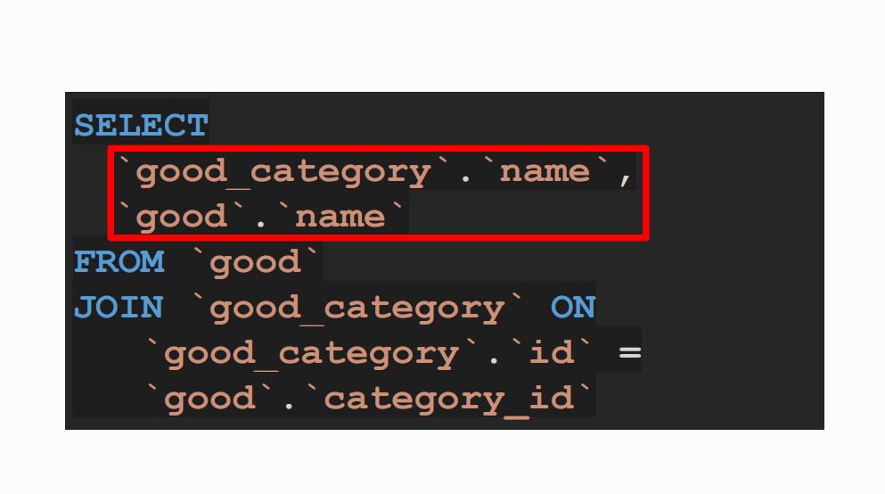

# JOIN Operator - Joining Tables

## Topic


## Task Analysis


## JOIN Operator


## Implementation of JOIN Query





## Types of Joins


## INNER JOIN


## LEFT JOIN and RIGHT JOIN


## Joining a Large Number of Tables


## Implementation of Joining a Large Number of Tables


[Drupal Open Source](https://www.drupal.org/)

## Analysis of Query Variations in phpMyAdmin

>- Selecting the name of the category and the name of the product from the 'good' table
>- Joining the 'good' table (aliased as g) with the 'good_category' table (aliased as c) using the category_id

```sql
SELECT
    c.name AS categoryName,
    g.name AS productName
FROM `good` g 	
JOIN good_category c ON c.id = g.category_id;
```

>- Selecting the ID and name from the 'good' table, along with the corresponding order_id from the 'order2good' table
>- Performing a LEFT JOIN to include all records from the 'good' table, even if there's no match in the 'order2good' table
>- Joining the 'good' table (aliased as g) with the 'order2good' table (aliased as o2g) using the good_id

```sql
SELECT
    g.id,
    g.name,
    o2g.order_id
FROM `good` g 
LEFT JOIN order2good o2g ON o2g.good_id = g.id;
```

>- Selecting the ID and name from the 'good' table and the corresponding order_id from the 'order2good' table
>- Performing a LEFT JOIN to include all records from the 'good' table, even if there's no match in the 'order2good' table
>- Joining the 'good' table (aliased as g) with the 'order2good' table (aliased as o2g) using the good_id
>- Filtering the results to only include rows where there is no corresponding order_id in the 'order2good' table

```sql
SELECT
    g.id,
    g.name,
    o2g.order_id
FROM `good` g 
LEFT JOIN order2good o2g ON o2g.good_id = g.id
WHERE o2g.order_id IS NULL;
```

>- Selecting the category name, product name, order creation date, and user name
>- Joining the 'good' table (aliased as g) with the 'good_category' table (aliased as c) using the category_id
>- Joining the 'order2good' table (aliased as o2g) to link goods to orders
>- Joining the 'order' table (aliased as o) using the order_id from 'order2good'
>- Including only orders created in August 2017 using the BETWEEN clause
>- Joining the 'user' table (aliased as u) using the user_id from the 'order' table

```sql
SELECT
    c.name AS categoryName,
    g.name AS productName,
    o.creation_date AS orderDate,
    u.name AS userName
FROM `good` g 
JOIN good_category c ON c.id = g.category_id
JOIN order2good o2g ON o2g.good_id = g.id
JOIN `order` o ON o.id = o2g.order_id AND o.creation_date BETWEEN '2017-08-01' AND '2017-08-31'
JOIN user u ON u.id = o.user_id;
```

## Practice on the topic

1. Retrieve the names of products and their categories for products with a price greater than 990 rubles.

```sql
SELECT good.name AS good_name, category.name AS category_name
FROM good
JOIN good_category ON good.category_id = good_category.id
WHERE good.price > 990;
```

```sql
SELECT
    `good`.name AS `good_name`,
    `good_category`.name AS `category_name`
FROM `good`
JOIN `good_category` ON
    `good`.category_id = `good_category`.id
WHERE `good`.price > 990;
```

```sql
SELECT
    `good`.name AS `good_name`,
    `good_category`.name AS `category_name`
FROM `good_category`
JOIN `good` ON
    `good`.category_id = `good_category`.id
WHERE `good`.price > 990;
```

2. Retrieve order numbers, product names, and their purchased quantities. Display the result in ascending order of the order number.

```sql
SELECT
    `order`.id AS `order_id`,
    `good`.name AS `good_name`,
    `order2good`.count AS `good_count`
FROM `good`
JOIN `order2good` ON
    `order2good`.good_id = `good`.id
JOIN `order` ON
    `order2good`.order_id = `order`.id
ORDER BY `order_id`;
```

3. Retrieve the names of users who have ordered at least once a product with the name containing "puer with milk."

```sql
SELECT `user`.name
FROM `good`
JOIN `order2good` ON
    `order2good`.good_id = `good`.id
JOIN `order` ON
    `order2good`.order_id = `order`.id
JOIN `user` ON
    `user`.id = `order`.user_id
WHERE `good`.name LIKE '%пуэр с молоком%';
```

4. Retrieve IDs and names of products that have never been ordered.

```sql
SELECT
    id,
    g.name
FROM `good` g
LEFT JOIN `order2good` o2g ON
    o2g.good_id = g.id
WHERE o2g.order_id IS NULL;
```
> Request (using RIGHT JOIN)

```sql
SELECT
    id,
    g.name
FROM `order2good` o2g
RIGHT JOIN `good` g ON
    o2g.good_id = g.id
WHERE o2g.order_id IS NULL;
```

5. Retrieve all transitions of order statuses with the identifier 2 in word form.

```sql
SELECT
    osc.order_id,
    os_src.name AS `from`,
    os_dst.name AS `to`
FROM `order_status_change` osc
JOIN `order_status` os_src ON
    os_src.id = osc.src_status_id
JOIN `order_status` os_dst ON
    os_dst.id = osc.dst_status_id
WHERE osc.order_id = 2;
```
