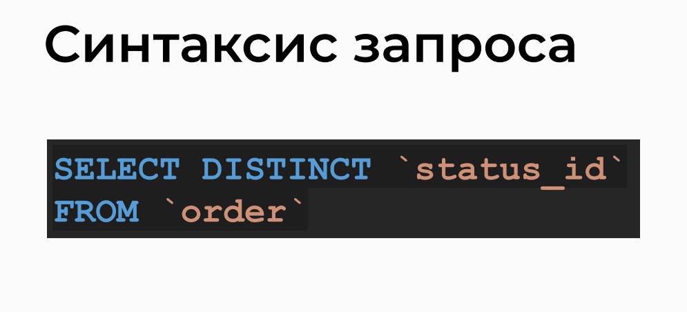
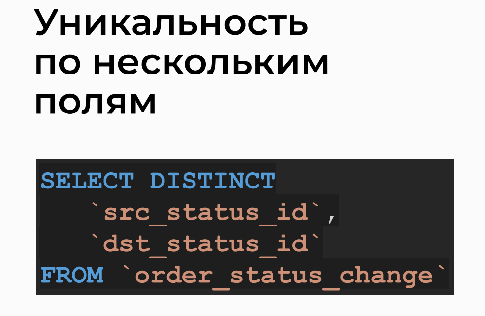
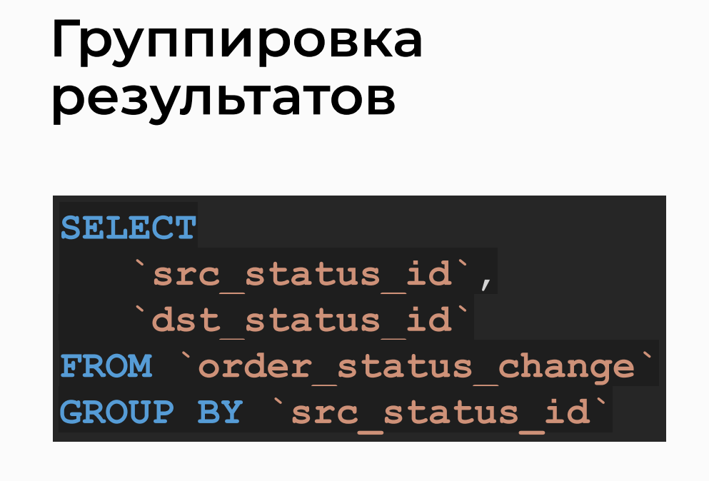
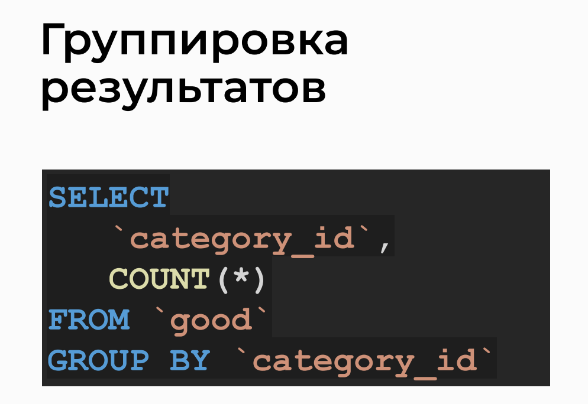

# Filtering By Uniqueness And Grouping Of Records

## Topic


## Query Syntax


## Uniqueness Across Multiple Fields


## Result Grouping





## Grouping by Multiple Fields


> The `SELECT` command from several fields when grouping may not work on hosts other than Timeweb (for example, in MySQL Workbench).
> The problem is described in more detail in the article [Blocking ONLY_FULL_GROUP_BY](https://stackoverflow.com/questions/23921117/disable-only-full-group-by).

## Analysis of Query Variations in phpMyAdmin

>- Select distinct source and destination status IDs from the 'order_status_change' table
```sql
SELECT DISTINCT src_status_id, dst_status_id
FROM `order_status_change` WHERE 1;
```
>- Select distinct pairs of source and destination status names from the 'order_status_change' table

```sql
SELECT DISTINCT
    s1.name AS src_status_name,
    s2.name AS dst_status_name
FROM `order_status_change` ch
JOIN `order_status` s1 ON s1.id = ch.src_status_id
JOIN `order_status` s2 ON s2.id = ch.dst_status_id
WHERE 1;
```

>- Select distinct pairs of source and destination status names from the 'order_status_change' table, grouped by source status ID
```sql
SELECT
    s1.name,
    s2.name
FROM `order_status_change` ch
JOIN `order_status` s1 ON s1.id = ch.src_status_id
JOIN `order_status` s2 ON s2.id = ch.dst_status_id
GROUP BY ch.src_status_id;
```

>- Count the number of goods in each category from the 'good' table
```sql
SELECT
    category_id,
    COUNT(*)
FROM `good`
GROUP BY category_id;
```

>- Count the number of goods in each category, displaying the category name and count, and order the results by count in descending order
```sql
SELECT
    c.name,
    COUNT(*) AS goods_count
FROM `good` g
JOIN `good_category` c ON c.id = g.category_id
GROUP BY g.category_id
ORDER BY goods_count DESC;
```

>- Group records from 'order_status_change' table by source and destination status IDs
```sql
SELECT *
FROM `order_status_change`
GROUP BY src_status_id, dst_status_id;
```

>- Select distinct pairs of source and destination status IDs from the 'order_status_change' table
```sql
SELECT DISTINCT
    src_status_id,
    dst_status_id
FROM `order_status_change`;
```


## Practice on the topic

> 1. Query: Output the order status IDs that appear in the 'order' table.

```sql
SELECT DISTINCT status_id
FROM `order`;
```

```sql
SELECT DISTINCT `status_id`
FROM `order`;
```

> 2. Query: Output the first five product IDs and the count of orders in which they appear.

```sql
SELECT
    `good_id`,
    COUNT(*)
FROM `order2good`
GROUP BY `good_id`
LIMIT 5;
```

> 3. Query: Output all unique transitions of order status using two different methods.

```sql
SELECT src_status_id, dst_status_id
FROM `order_status_change`
GROUP BY src_status_id, dst_status_id;
```

```sql
SELECT DISTINCT src_status_id, dst_status_id
FROM `order_status_change`;
```

```sql
SELECT
    `src_status_id`,
    `dst_status_id`
FROM `order_status_change`
GROUP BY `src_status_id`, `dst_status_id`;
```

```sql
SELECT DISTINCT
     `src_status_id`,
     `dst_status_id`
FROM `order_status_change`;
```

> 4. Query: Output the names of order statuses and the count of orders with each status, sorted in ascending order of count.

```sql
SELECT os.name AS status_name, COUNT(o.status_id) AS order_count
FROM `order` o
JOIN `order_status` os ON os.id = o.status_id
GROUP BY os.name
ORDER BY order_count ASC;
```

```sql
SELECT
    os.`name`,
    COUNT(*) `count`
FROM `order` o
JOIN `order_status` os ON
    os.id = o.status_id
GROUP BY os.`name`
ORDER BY `count`;
```

