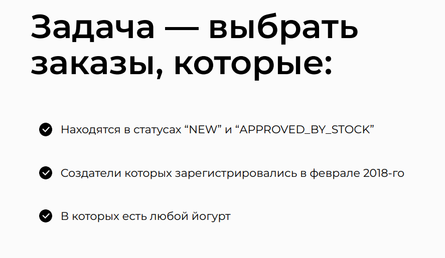
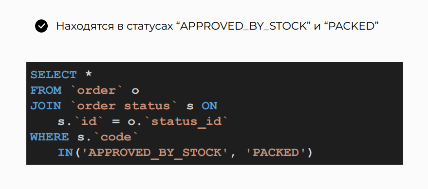
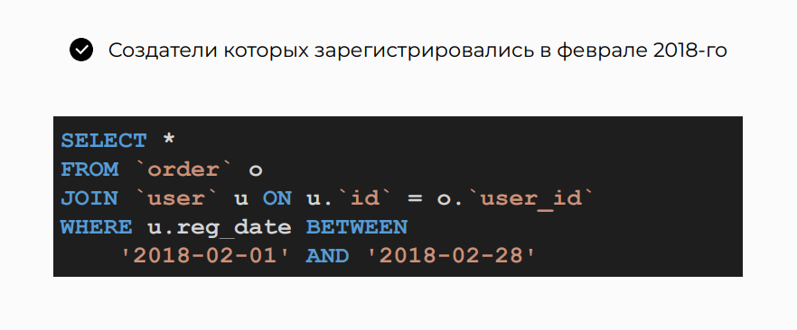
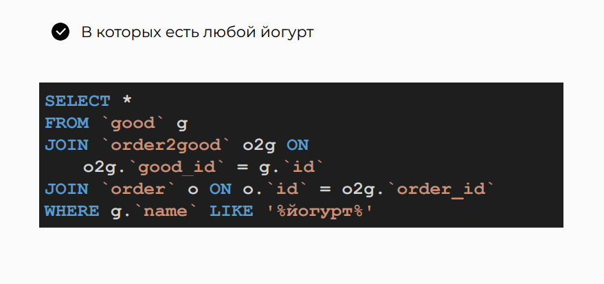
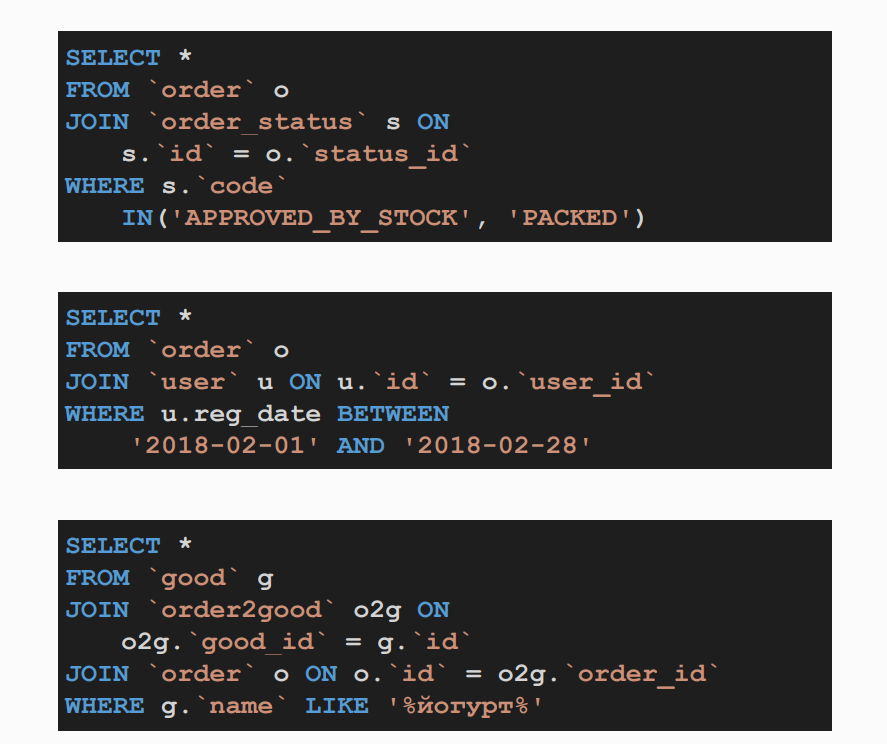
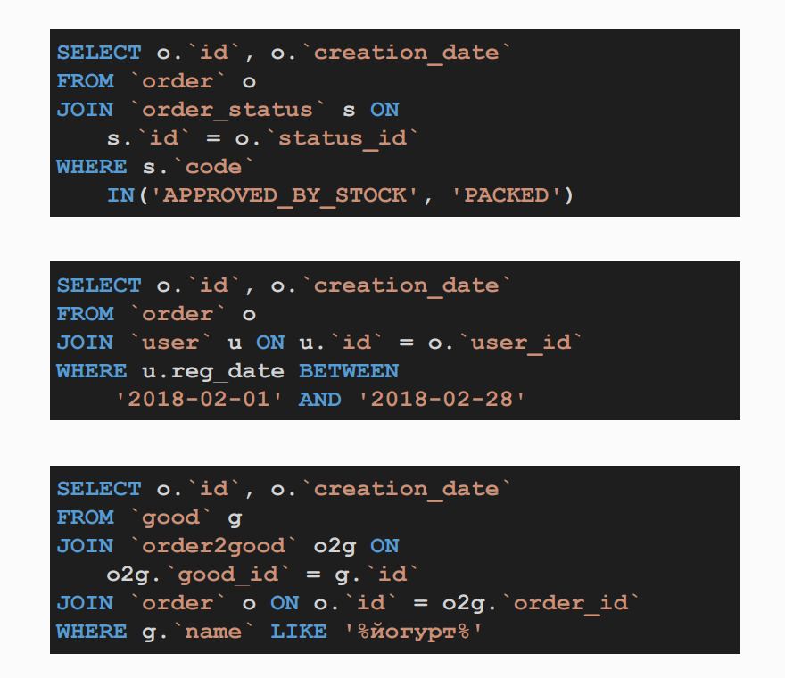
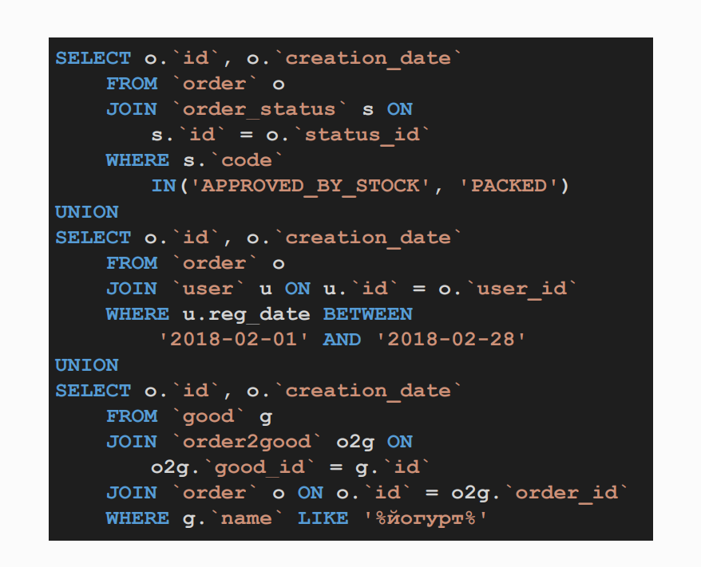

# Combining The Results, The UNION Operator

## Topic


## Analyzing Requests for Each Result








## Applying the UNION Operator


## Implementation of the Query





## Analysis of Query Variations in phpMyAdmin

>- Select all columns from the 'order' table and 'order_status' table
>- Joining 'order' and 'order_status' tables on the status_id column
>- Filtering records where the status code is either 'APPROVED_BY_STOCK' or 'PACKED'
```sql
SELECT * 
FROM `order` o
JOIN `order_status` s ON s.`id` = o.`status_id`
WHERE s.`code` IN('APPROVED_BY_STOCK', 'PACKED');
```

>- Select all columns from the 'order' table and 'user' table
>- Joining 'order' and 'user' tables on the user_id column
>- Filtering records where the registration date of the user is between '2018-02-01' and '2018-02-28'
```sql
SELECT * 
FROM `order` o
JOIN `user` u ON u.`id` = o.`user_id`
WHERE u.reg_date BETWEEN '2018-02-01' AND '2018-02-28';
```

>- This query selects all records from the `good` table which are joined with the `order2good` and `order` tables based on the matching IDs.
>- The WHERE clause filters the results to only include goods whose name contains 'йогурт'.
```sql
SELECT *
FROM `good` g
JOIN `order2good` o2g ON o2g.`good_id` = g.`id`
JOIN `order` o ON o.`id` = o2g.`order_id`
WHERE g.`name` LIKE '%йогурт%'
```

## Practice on the topic

> Print the names and email of those users who:

> Or ordered products whose name begins with "Guatemala";  
> Or they have a top-level mail domain gov and have paid for the order at the same time;  
> Or ordered products from the category "Decaf Coffee".  

```sql
SELECT
    u.`name`,
    u.`email`
FROM `good` g
JOIN `order2good` o2g ON o2g.good_id = g.id
JOIN `order` o ON o.id = o2g.order_id
JOIN `user` u ON u.id = o.user_id
WHERE g.`name` LIKE 'Гватемала%'

UNION

SELECT
    u.`name`,
    u.`email`
FROM `user` u
JOIN `order` o ON
    o.user_id = u.id AND o.status_id = 7
WHERE
    u.`email` LIKE '%gov' 

UNION

SELECT
    u.`name`,
    u.`email`
FROM `user` u
JOIN `order` o ON o.user_id = u.id
JOIN `order2good` o2g ON o2g.order_id = o.id
JOIN `good` g ON g.id = o2g.good_id
JOIN `good_category` gc ON gc.id = g.category_id AND gc.name = 'Кофе без кофеина';

```
