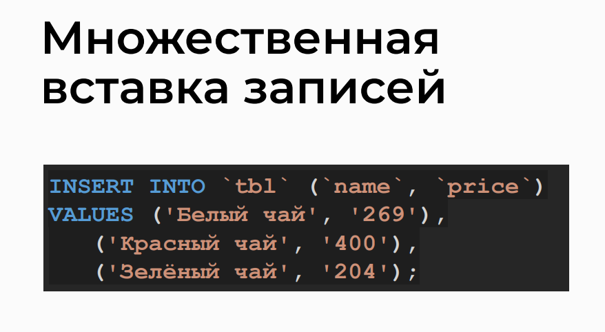

# SQL Queries: INSERT, UPDATE, and DELETE

## Topic


## Adding Data, INSERT Operator


## Default Values (DEFAULT)


## VALUES Operator


## AUTO_INCREMENT


## Multiple Record Insertion


## Data Modification Queries


## Deleting Records from a Table


## Analyzing a Dump File
> A database dump is a file containing both the structure and content of the database.


## Analysis of Query Variations in phpMyAdmin

>- Inserting a new record into the 'good' table
```sql
INSERT INTO `good` (category_id, name, count, price)
VALUES(6, 'White tea with Strawberry', 50, 134);
```

>- Inserting multiple records into the 'tbl' table
```sql
INSERT INTO `tbl` (`name`, `price`)
VALUES ('White tea', '269'), -- Record 1
       ('Read tea', '400'),  -- Record 2
       ('Green tea', '204'); -- Record 3
```

>- Updating the 'name' column in the 'good' table
```sql
UPDATE `good` 
SET `name` = 'Candy'  -- Setting the new value
WHERE `id` = 1055;    -- Specifying the record to update based on the 'id'
```

>- Updating the 'price' column in the 'good' table
```sql
UPDATE `good` 
SET price = price + 50 
WHERE `count` > 0 AND `count` < 10;
```

>- Deleting a record from the 'good' table
```sql
DELETE FROM `good`
WHERE `id` = 1373;
```

## Practice on the topic

>- Insert four new products into the 'good' table with prices above 1000 rubles and non-zero quantities
```sql
INSERT INTO `good` (`category_id`, `name`, `count`, `price`)
VALUES 
    (1, 'New Product 1', 5, 1200),
    (2, 'New Product 2', 8, 1500),
    (3, 'New Product 3', 3, 1800),
    (4, 'New Product 4', 10, 2000);
```
```sql
INSERT INTO `good`
(`category_id`, `name`, `count`, `price`)
VALUES
(1, 'First', 1, 1001),
(2, 'Second', 2, 1002),
(3, 'Third', 3, 1003),
(4, 'Fourth', 4, 1004);

```
>- Set the count to zero for products with prices above 1000 rubles using a single UPDATE query

```sql
UPDATE `good`
SET `count` = 0
WHERE `price` > 1000;
```

```sql
UPDATE `good` SET
    `count` = 0
WHERE `price` > 1000;
```

>- Triple the price for all products with prices above 1000 rubles using a single UPDATE query

```sql
UPDATE `good`
SET `price` = `price` * 3
WHERE `price` > 1000;
```

```sql

UPDATE `good` SET
    `price` = `price` * 3
WHERE `price` > 1000;

```

>- Delete the added products using a single DELETE query with the condition "price is more than 1000 rubles"

```sql
DELETE FROM `good`
WHERE `price` > 1000;
```

```sql
DELETE FROM `good`
WHERE `price` > 1000;
```


