# WHERE Operator And Complex Conditions

## Тема 

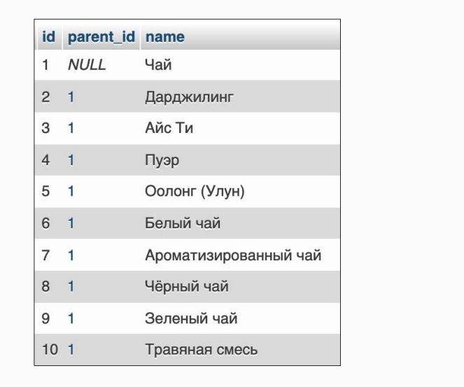

## Operator LIKE
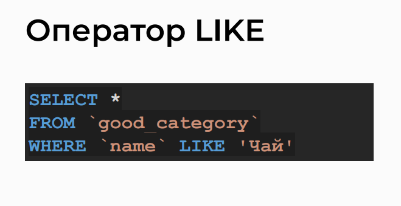
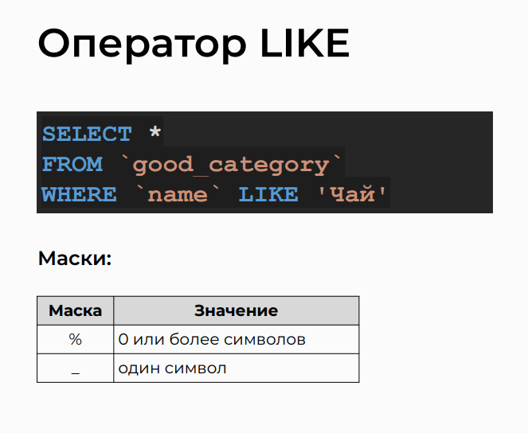

## Маски
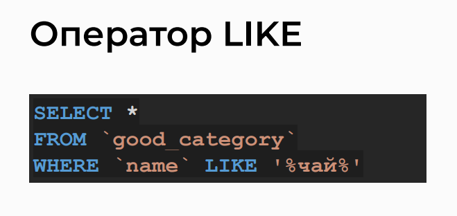
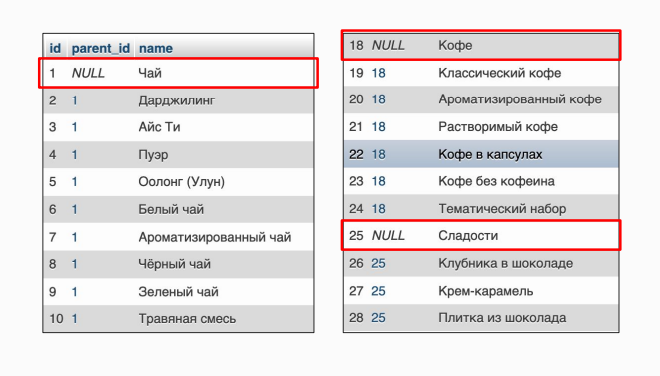

## Сравнение с NULL
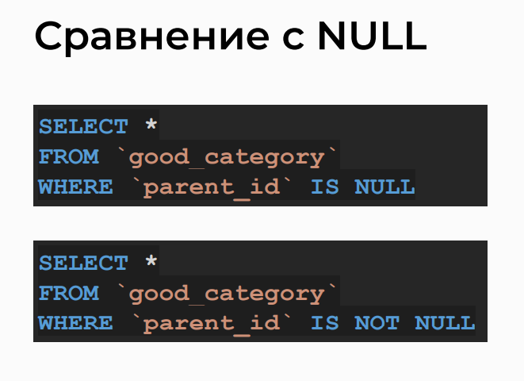
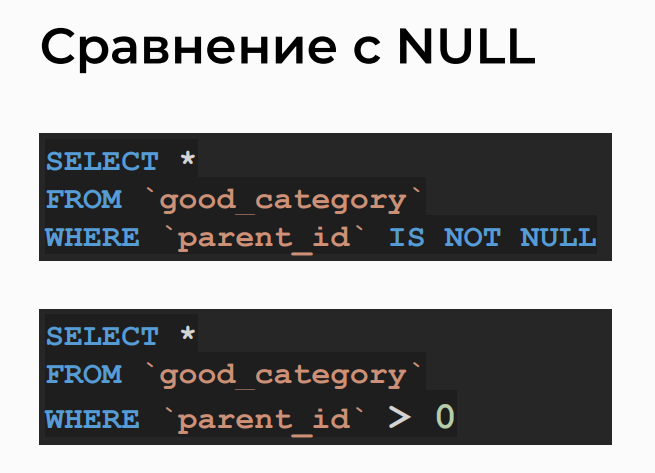
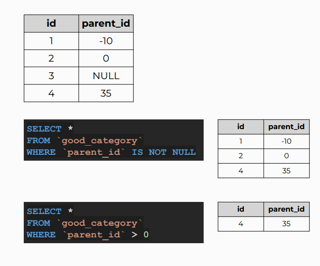
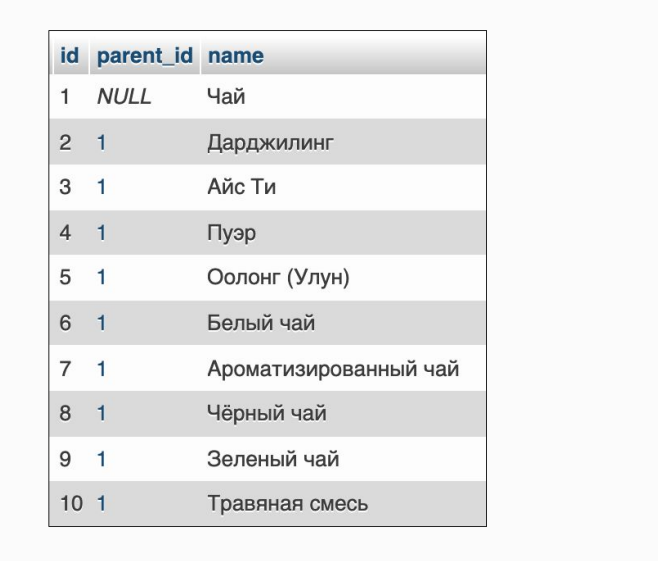

## Объединение нескольких условий
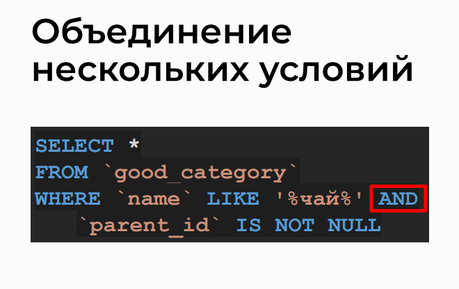
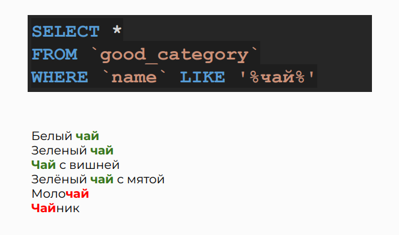

## Условия
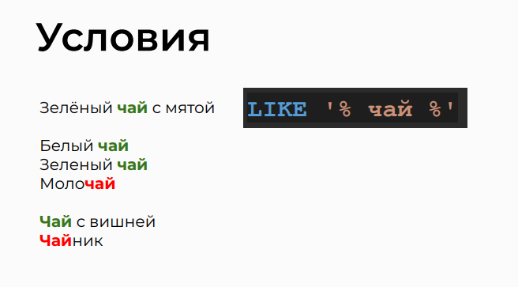
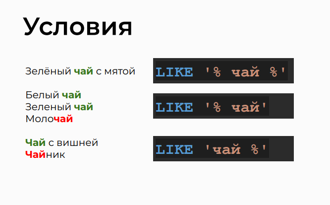

## Одно из условий
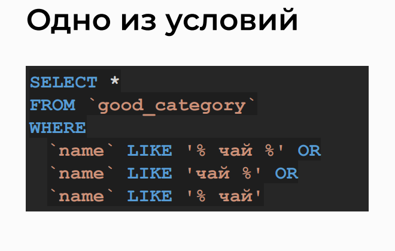
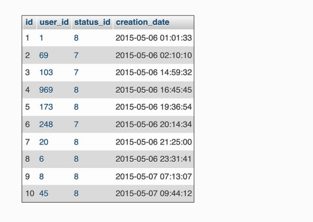
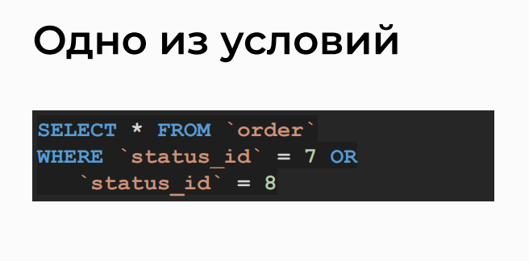

## Группа значений
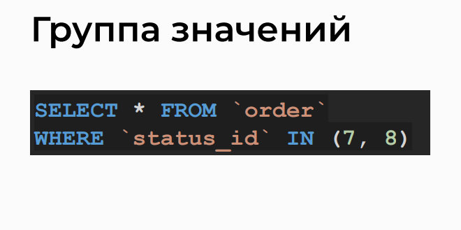
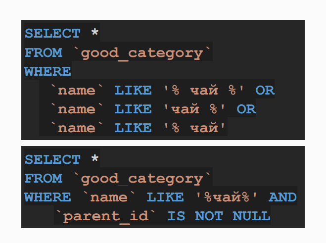

## Круглые скобки
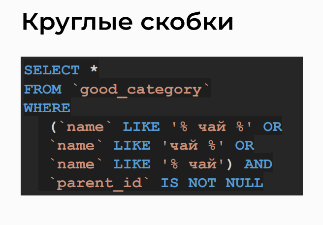
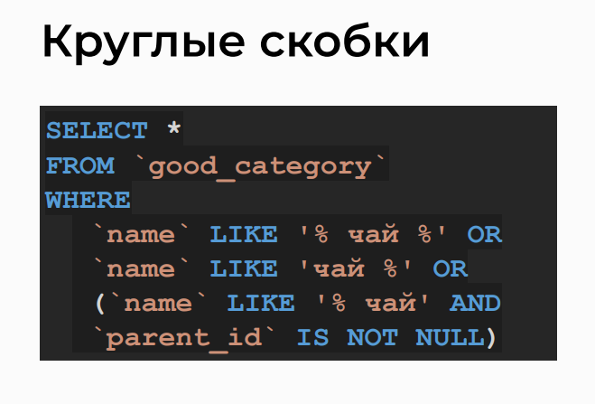

## Note 
If the time is not specified in the date value, it is assumed to be 00:00:00 by default. 
To include all registrations on December 31, 2018, in the date range, you should use the `strictly less than` operator and the date of the next day, like this: 'reg_date' < '2019-01-01'.

> SQL query to select dates between two dates
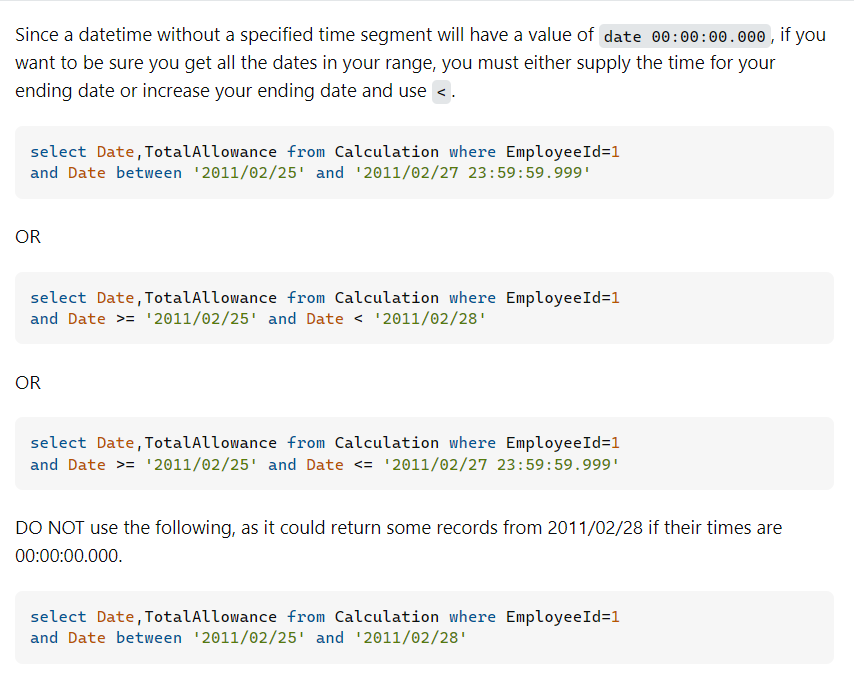

[SQL query](https://stackoverflow.com/questions/5125076/sql-query-to-select-dates-between-two-dates/22081848#22081848)


## Analysis of Query Variations in phpMyAdmin

-> Select all records from the 'order' table
```sql
SELECT * FROM `order`;
```
-> Select all records from the 'order_status' table
```sql
SELECT * FROM `order_status`;
```
-> Select all records from the 'order_status_change' table
```sql
SELECT * FROM `order_status_change`;
```
-> Select records from the 'order_status_change' table where certain conditions are met
-> Source status is 4 and destination status is 8
-> Source status is 1 and destination status is 4 or 6
-> time is within the specified date range

```sql
SELECT * FROM `order_status_change` 
WHERE ((src_status_id = 4 AND dst_status_id = 8) OR (src_status_id = 1 AND dst_status_id IN(4, 6)))
AND `time` BETWEEN '2018-01-01' AND '2018-12-31';
```

## Practice on the topic

> 1. Retrieve from the `good` table the list of IDs and names of products where the quantity in stock is more than 518 units.

```sql
SELECT id, name
FROM good
WHERE count > 518;
```

```sql
SELECT
    `id`,
    `name`
FROM `good`
WHERE `count` > 518;
```

> 2. Retrieve from the `good` table the list of IDs, names, and prices of products that are out of stock and have a price of at least 300 rubles.
```sql
SELECT id, name, price
FROM good
WHERE count = 0 AND price >= 300;
```

```sql
SELECT
    `id`,
    `name`,
    `price`
FROM `good`
WHERE
    `count` = 0 AND
    `price` >= 300;
```

> 3. Retrieve from the `good` table the list of IDs and names of products where the name contains the word "таежный".
```sql
SELECT id, name
FROM good
WHERE name LIKE '%таежный%';
```

```sql
SELECT
    `id`,
    `name`
FROM `good`
WHERE `name` LIKE '%таежный%';
```

> 4. Retrieve from the `good` table the list of IDs and names of products where the name contains the word "манго" but does not contain the word "айс".
```sql
SELECT id, name
FROM good
WHERE name LIKE '%манго%' AND name NOT LIKE '%айс%';
```

```sql
SELECT
    `id`,
    `name`
FROM `good`
WHERE
    `name` LIKE '%манго%' AND
    `name` NOT LIKE '%айс%';
```

> 5. Retrieve the list of user IDs, names, and registration dates for users whose names contain the string "Иван" and who registered in the period from spring to autumn 2017.

>- Comment: Select the necessary fields, and in the WHERE condition, specify two logical conditions. The first one is for the presence of a name, where the surrounding characters of the searched substring can be arbitrary. The second one is for the required date range from the beginning of spring to the end of autumn. It's important to remember about the extreme dates in the query and use comparison operators accordingly. In this case, use "greater than or equal to" before the date '2017-03-01' and "strictly less than" before the date '2017-12-01'. This means that the query will include only registrations made from 00:00:00 on March 1, 2017, inclusive, to 00:00:00 on December 1, 2017, exclusive.

```sql
SELECT id, name, reg_date
FROM user
WHERE name LIKE '%Иван%' AND reg_date BETWEEN '2017-03-21' AND '2017-12-01';
```

```sql
SELECT
    `id`,
    `name`,
    `reg_date`
FROM `user`
WHERE
    `name` LIKE '%Иван%' AND
    `reg_date` >= '2017-03-01' AND
    `reg_date` < '2017-12-01';
```
