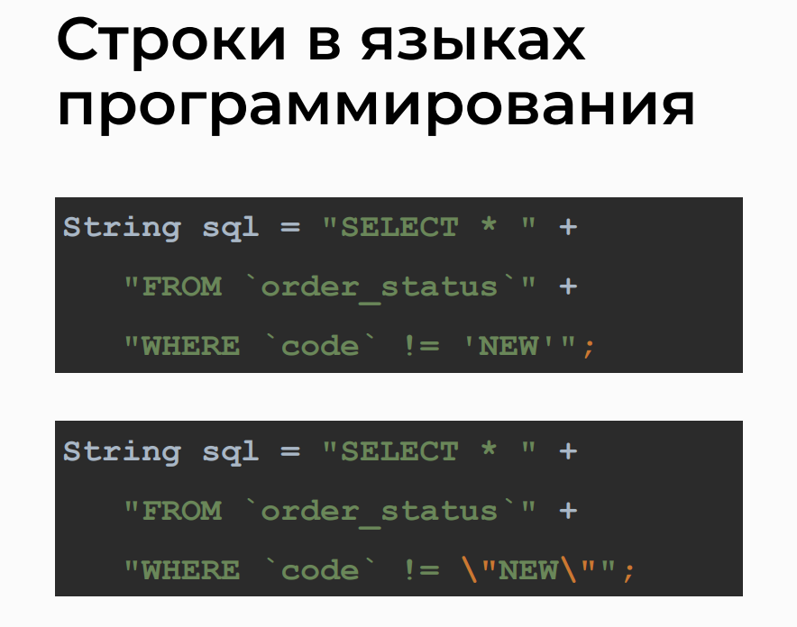

# WHERE Operator

## Filtering: Equality to a Number
> Exploring how to filter data based on equality to a specific number.


## Filtering: Greater Than or Less Than with Numbers
> Understanding how to filter data using greater than or less than conditions with numerical values.


## Filtering: Strings and Inequality
> Discussing string filtering and inequality conditions.


## Strings in Programming Languages
> An overview of working with strings in programming languages.



## Filtering: Dates
> Exploring how to filter data based on dates.


## Filtering: Date and Time Range
> Understanding how to filter data within a specified date and time range.


## Analysis of Query Variations in phpMyAdmin
> Examining different query options and variations in phpMyAdmin.


>- Selects all columns from the 'good' table
```sql
SELECT * FROM `good`;
```

>- Selects all columns from the 'good' table where the 'count' is less than 20
```sql
SELECT * FROM `good` WHERE `count` < 20;
```

>- Selects all columns from the 'good' table where the 'count' is less than 20, ordered by 'count' in ascending order
```sql
SELECT * FROM `good` WHERE `count` < 20 ORDER BY `good`.`count` ASC;
```

>- Selects the 'name' and 'count' columns from the 'good' table where the 'count' is less than 20
```sql
SELECT `name`, `count` FROM `good` WHERE `count` < 20;
```

>- Selects all columns from the 'user' table
```sql
SELECT * FROM `user`;
```

>- Selects all columns from the 'user' table where the 'name' is 'Лашманов Артур'
```sql
SELECT * FROM `user` WHERE `name`='Лашманов Артур';
```

>- Selects all columns from the 'order' table where the 'creation_date' is between '2019-07-01' and '2019-07-31'
```sql
SELECT * FROM `order` WHERE `creation_date` BETWEEN '2019-07-01' AND '2019-07-31';
```

