# Understanding Expressions and Functions in SQL Queries

## Topic
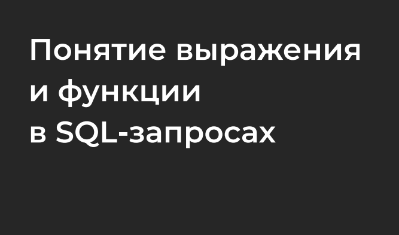

## The concept of expressions
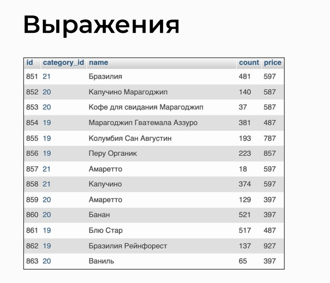

## What are expressions
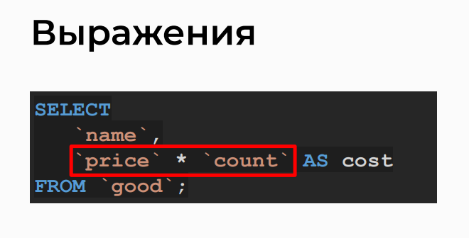

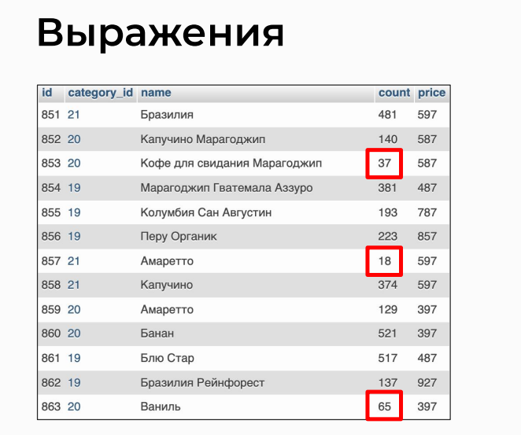

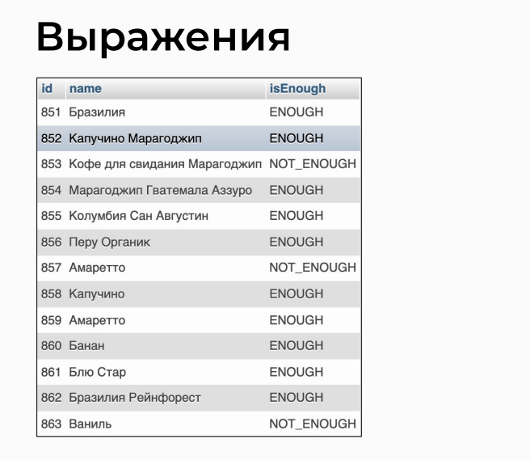

## Expressions with the "if" operator

## What are expressions with the "if" operator
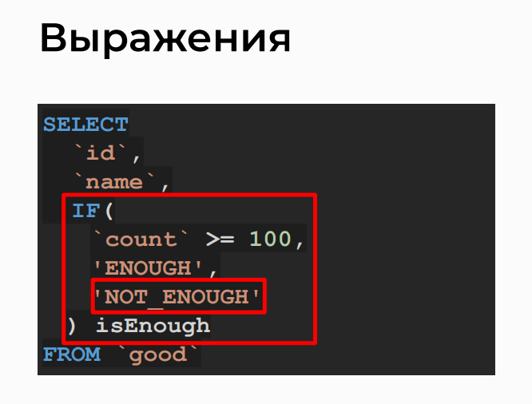

## Functions
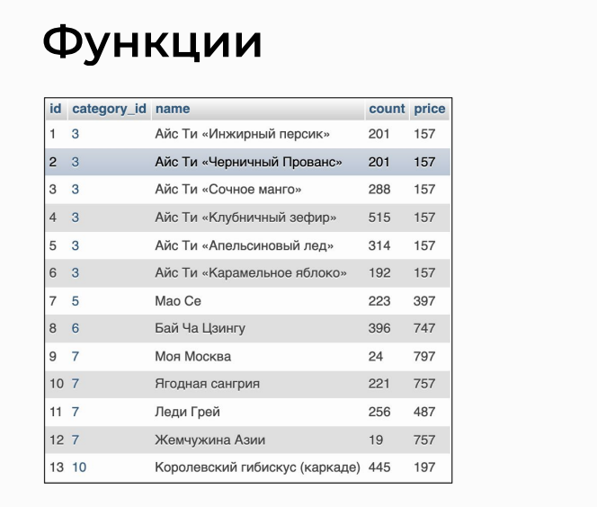

## What are functions
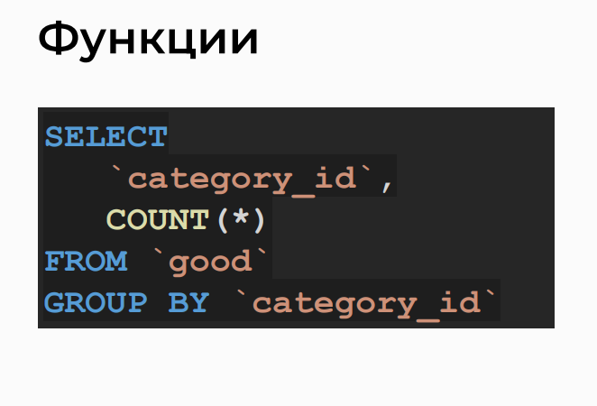

## Functions in queries
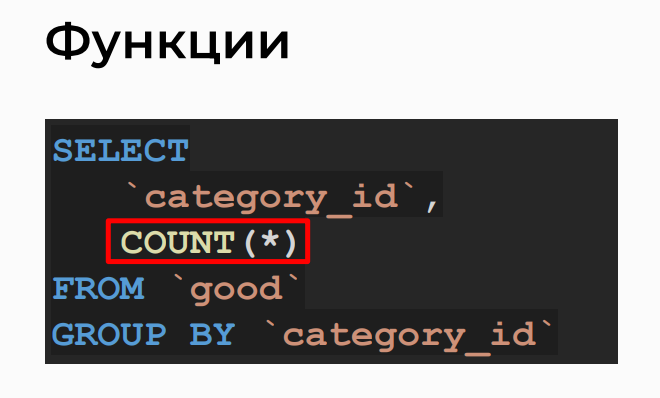

## Functions in SQL
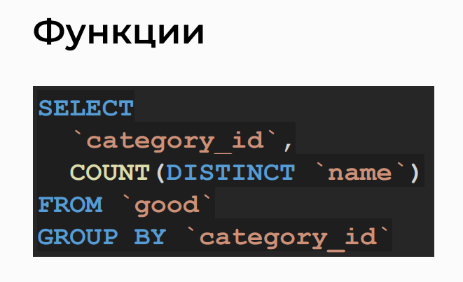

## Function types
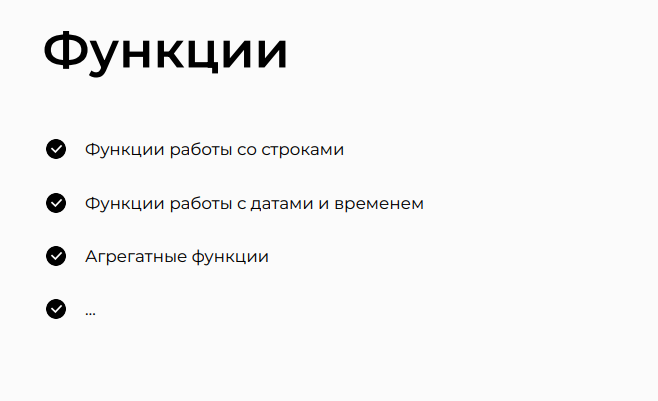

