# Conditional Operators and Boolean Expressions

## Topic


## If Operator
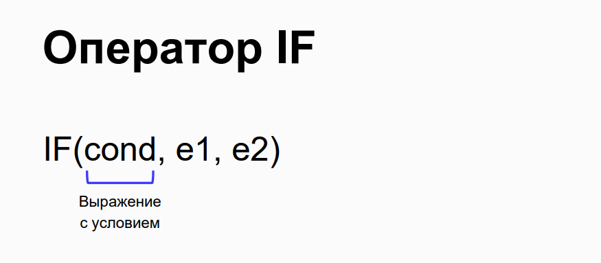

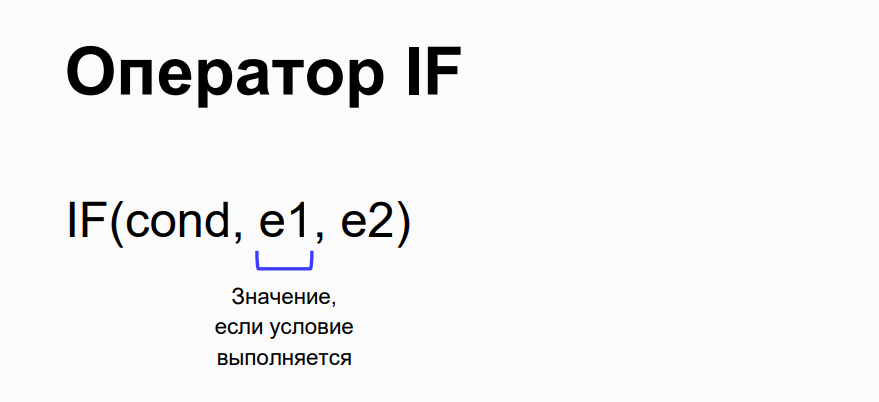

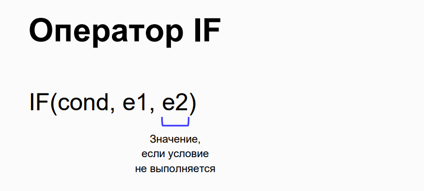

## Example of if Operator
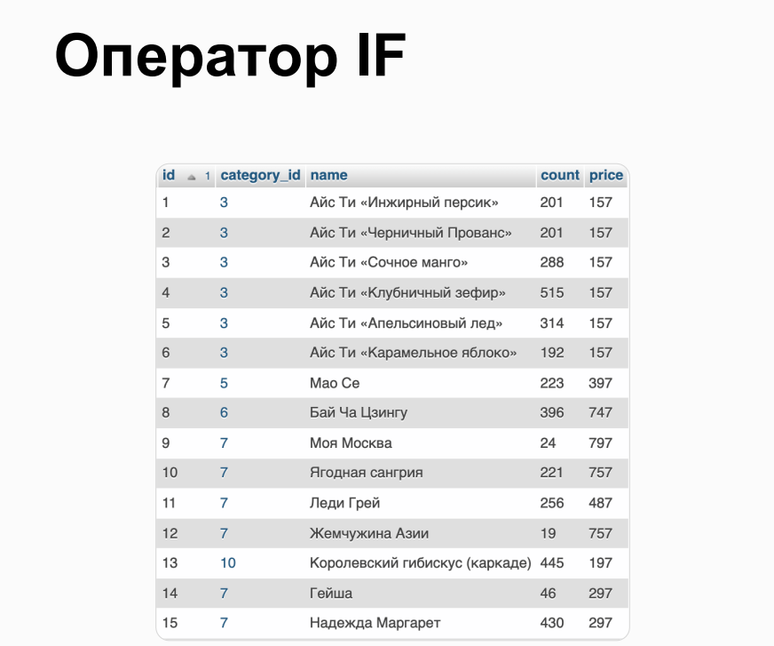

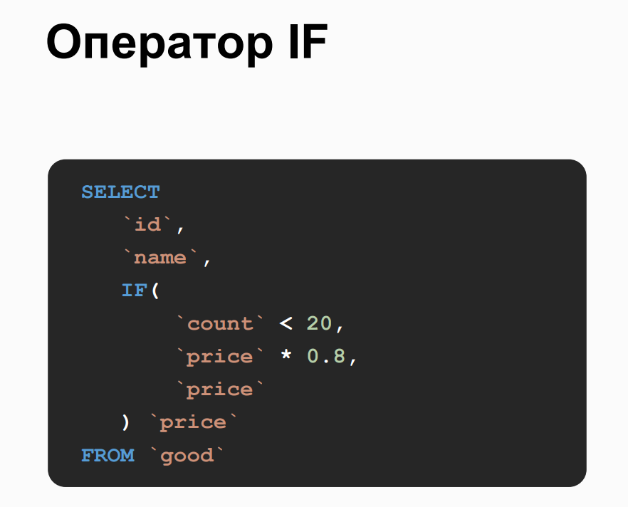

## Conditions with NULL
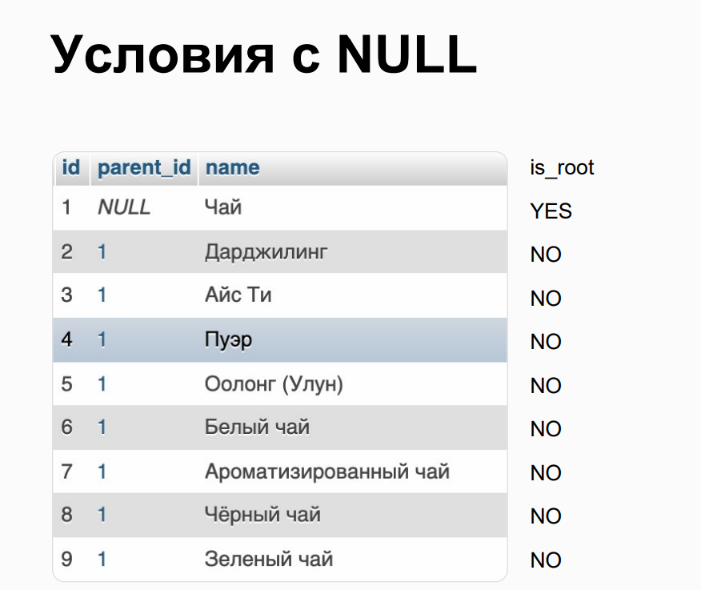

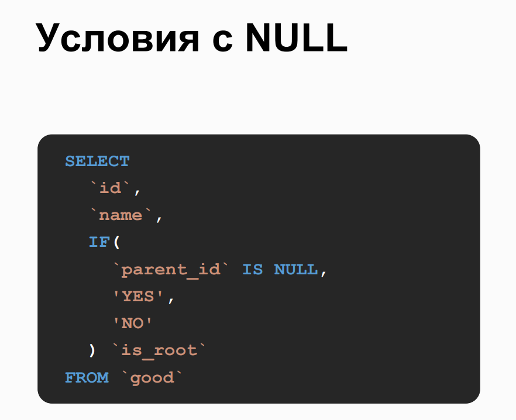

## Combining Multiple Conditions
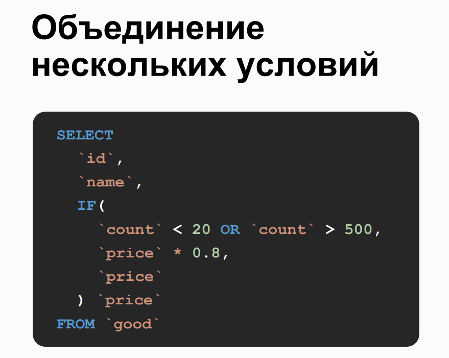

## Parentheses in Conditions
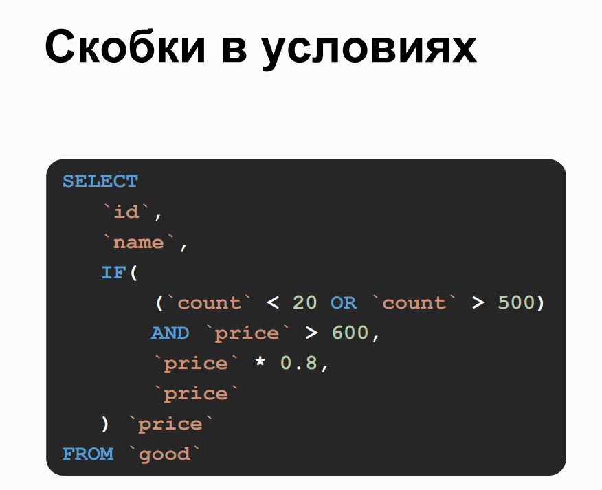

## Nested if Operators
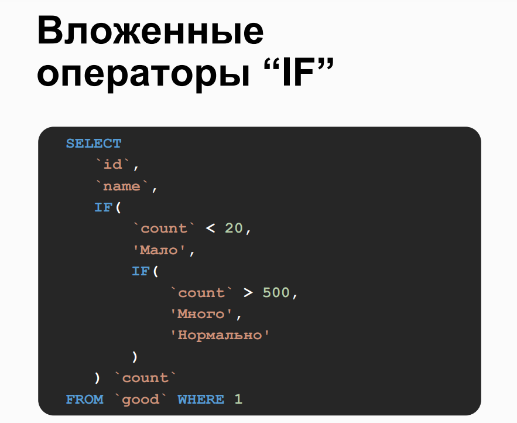

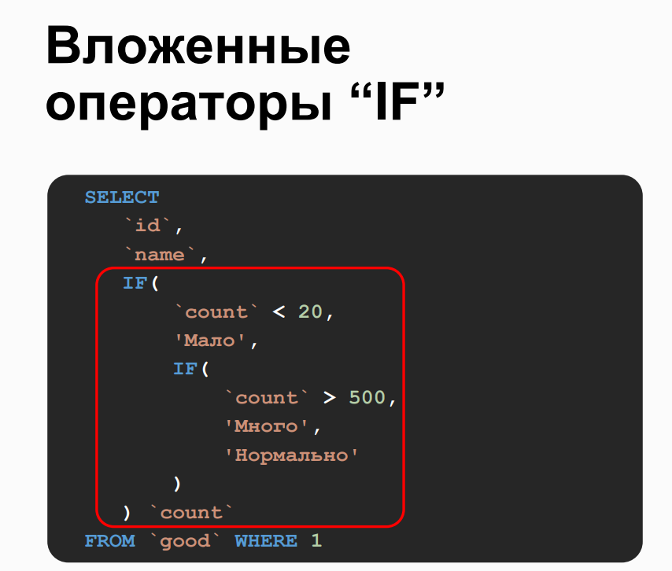

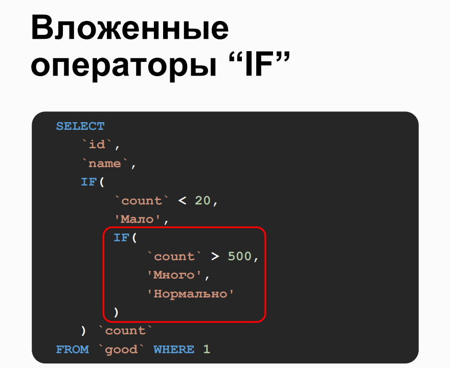

## Case Operator
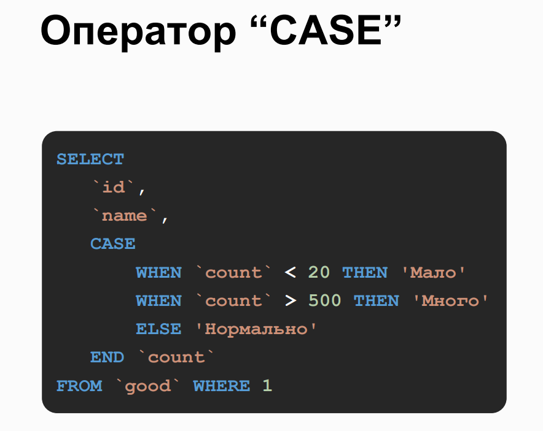

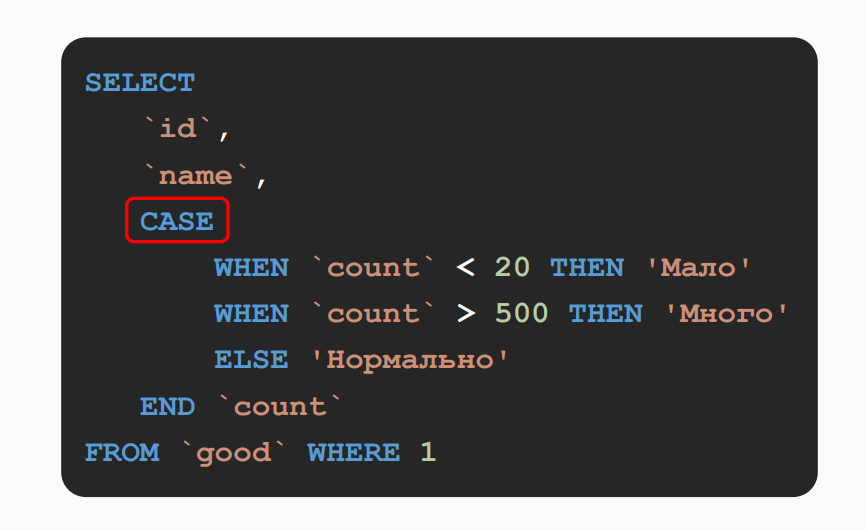

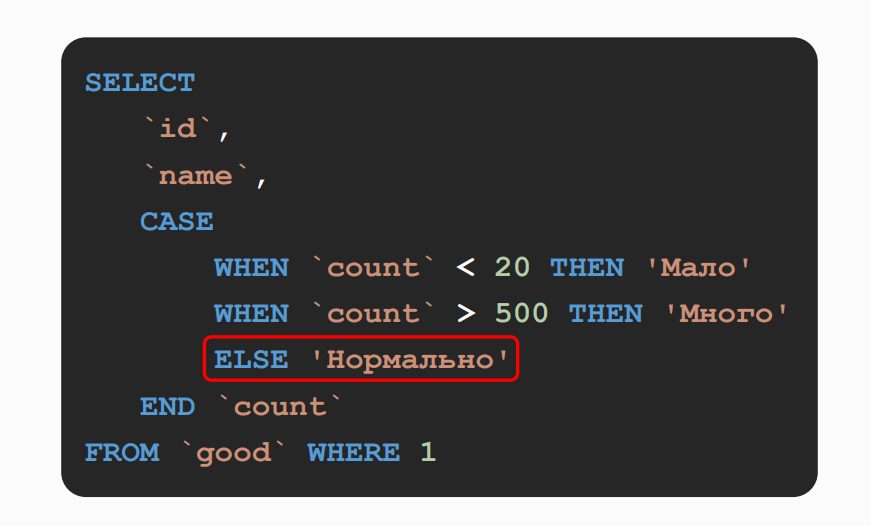

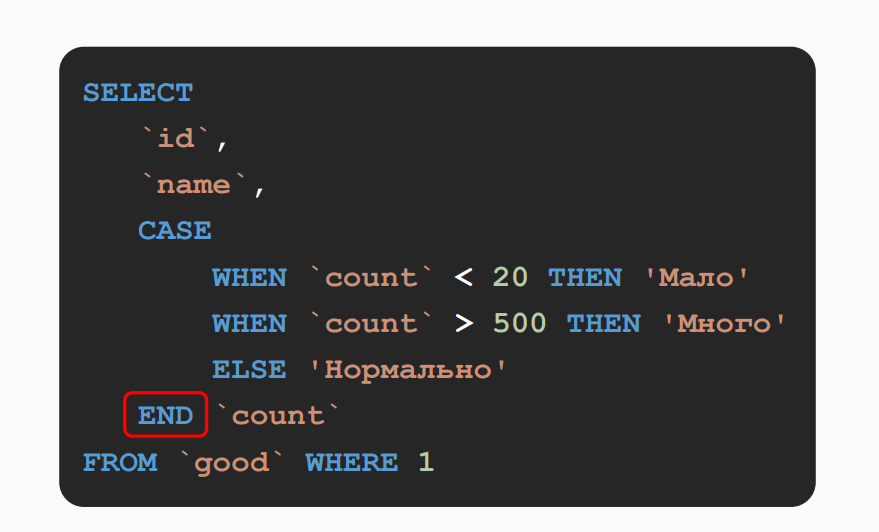


## Practice on the topic

> 1. Retrieve the parent category, the count of items in such a category, and a column indicating whether the count is "even" or "odd" for such items.
> - Select the parent category ID, count of items in the category, and determine if the count is even or odd.
> - Use IF to determine if the count is even or odd and assign 'чётное' or 'нечётное' accordingly.

```sql
SELECT
    `parent_id`,
    COUNT(*) `count`,
    IF(
        COUNT(*) % 2 = 0,
        'чётное',
        'нечётное'
    ) `even_or_odd`
FROM `good_category`
-- Group the results by parent category ID.
GROUP BY `parent_id`;
```

> 2. Retrieve the category identifier, name, count, and "status" of products, the total cost of which is at least 390,000 rubles, using two methods: with IF and with CASE.
> Define the "status" as a value depending on the product itself:
> - If the product does not belong to the root tea category, its status is 'NOT TEA'.
> - If it is tea and there are more than 500 units, the status is 'ENOUGH'.
> - Otherwise, 'NOT ENOUGH'.

```sql
SELECT
    g.category_id,
    g.`name`,
    g.`count`,
    IF(
        gc2.name = 'Чай',
        IF (g.`count` > 500, 'ENOUGH', 'NOT ENOUGH'),
        'NOT TEA'
    ) `status`
FROM `good` g
JOIN `good_category` gc ON gc.id = g.category_id
JOIN `good_category` gc2 ON gc2.id = gc.parent_id
WHERE g.`count` * g.`price` > 390000;
```

```sql
SELECT
    g.category_id,
    g.`name`,
    g.`count`,
    CASE
        WHEN gc2.`name` != 'Чай' THEN 'NOT TEA'
        WHEN g.`count` > 500 THEN 'ENOUGH'
        ELSE 'NOT ENOUGH'
    END AS `status`
FROM `good` g
JOIN `good_category` gc ON gc.id = g.category_id
JOIN `good_category` gc2 ON gc2.id = gc.parent_id
WHERE g.`count` * g.`price` > 390000;
```
