# Date Functions

## Topic


## Date and Time Formats
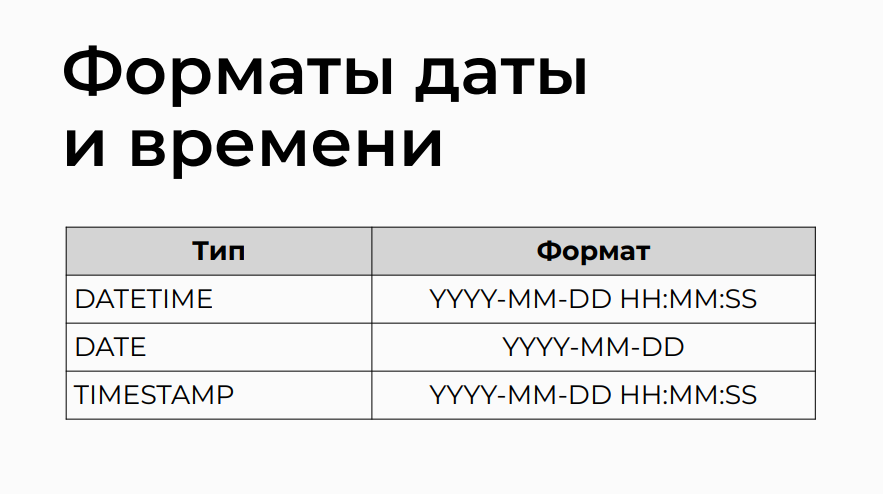

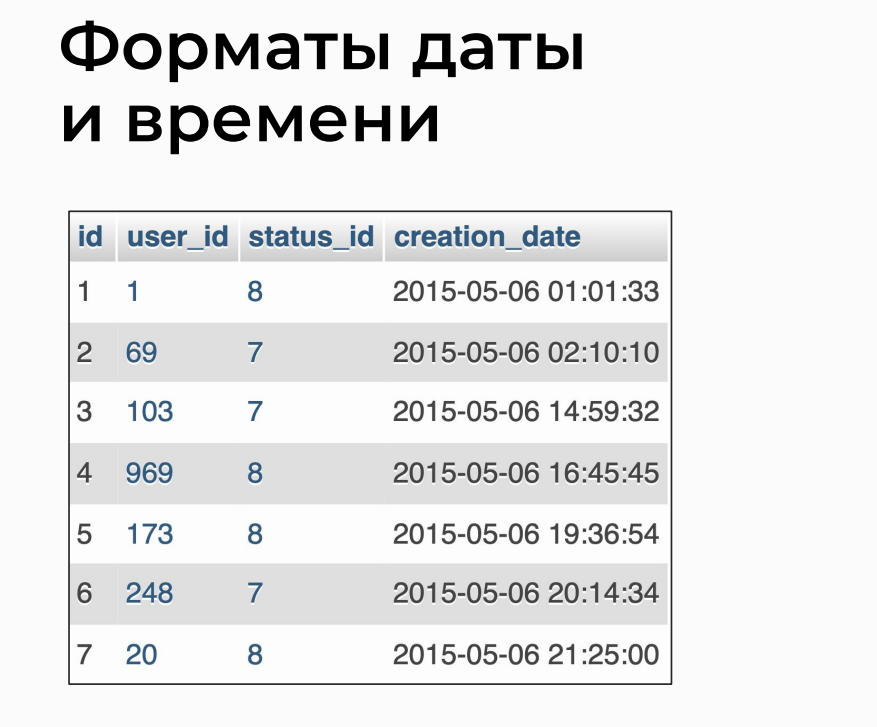

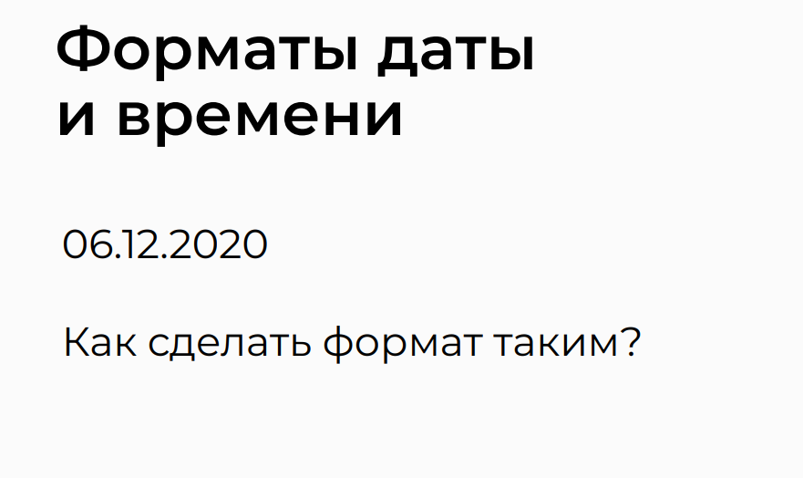

## DATE_FORMAT Function
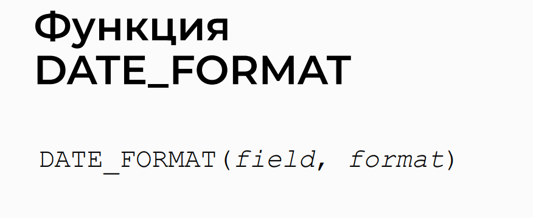

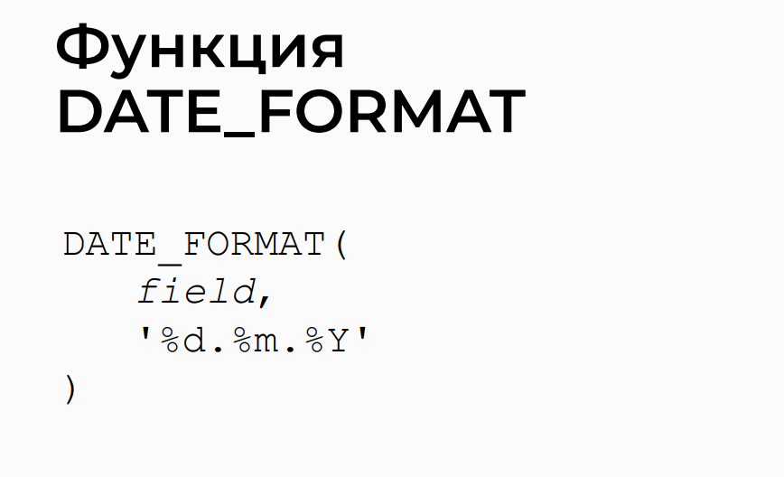

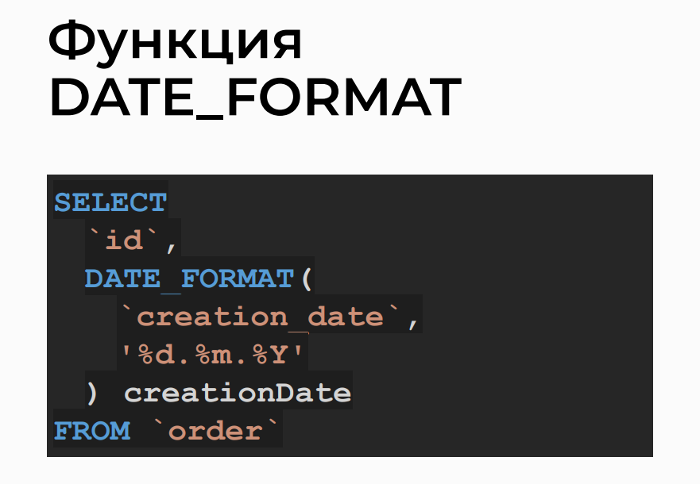

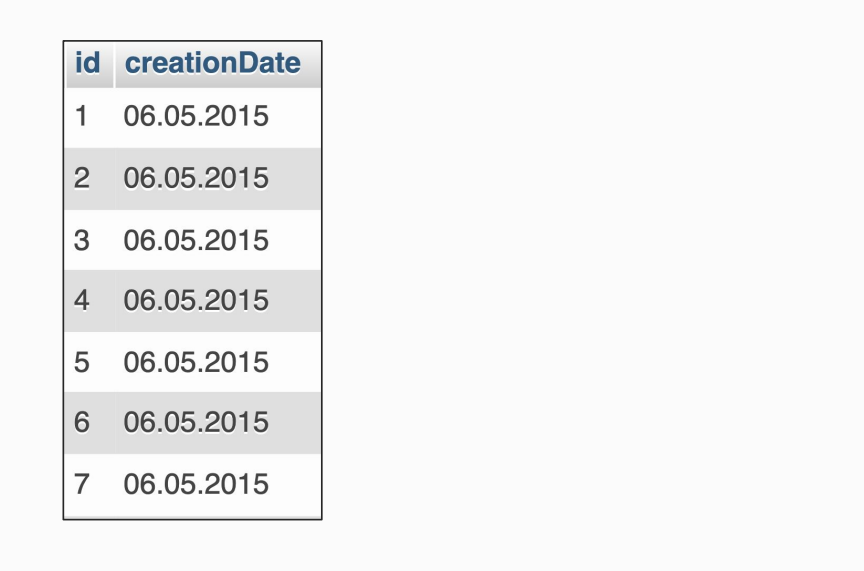

## Date Output Symbols
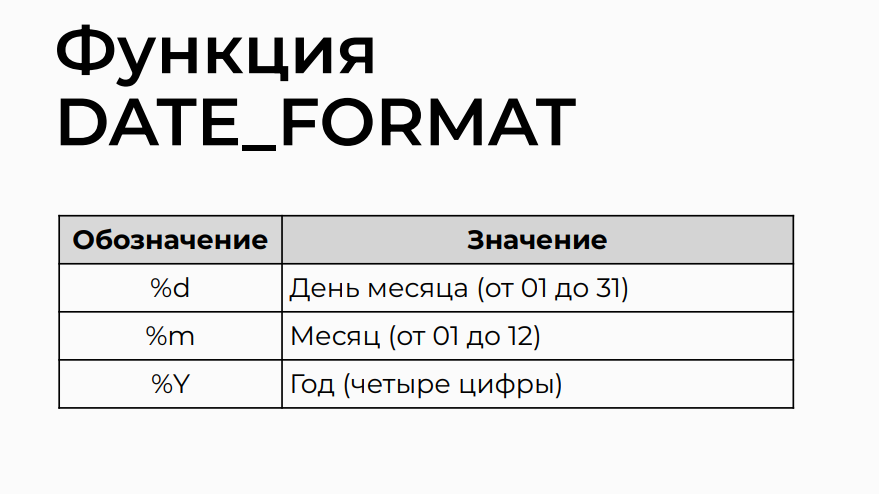

## Time Designation Symbols
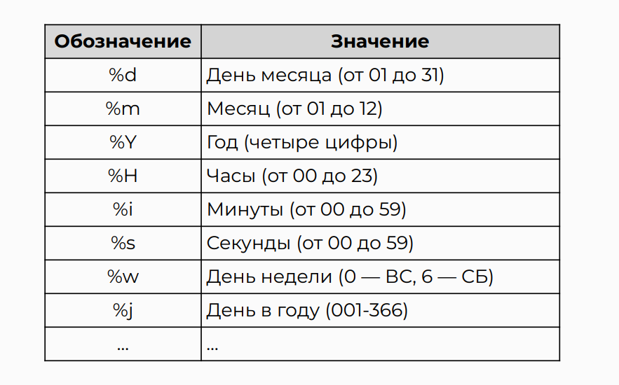

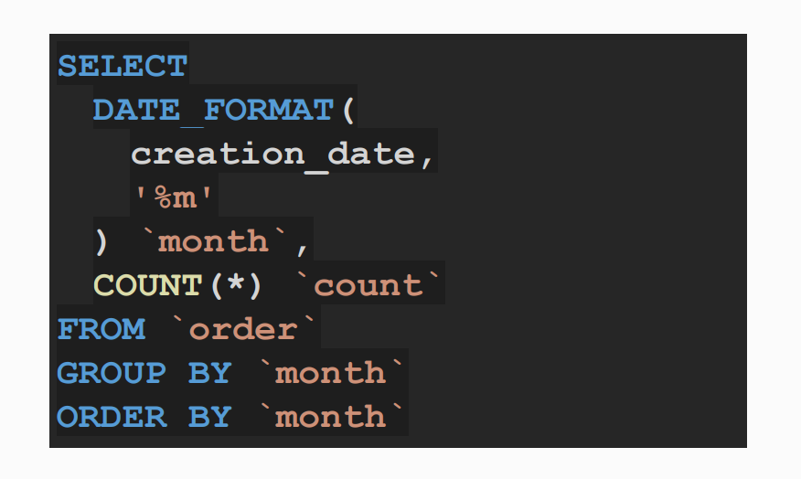

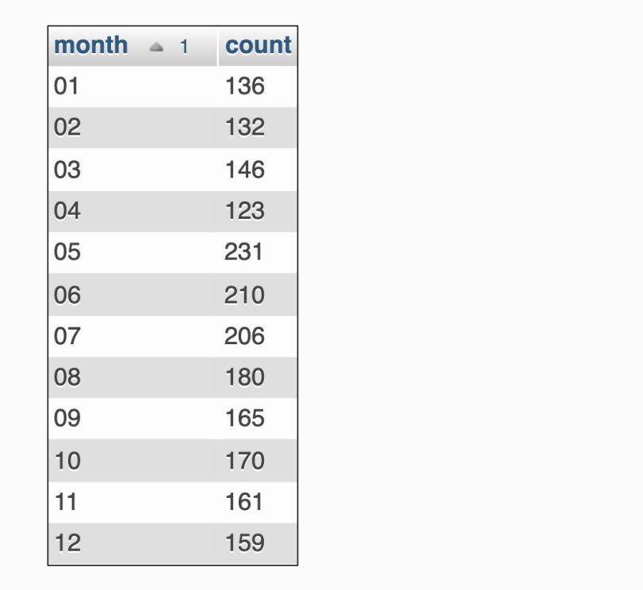

## Date Properties Output Functions
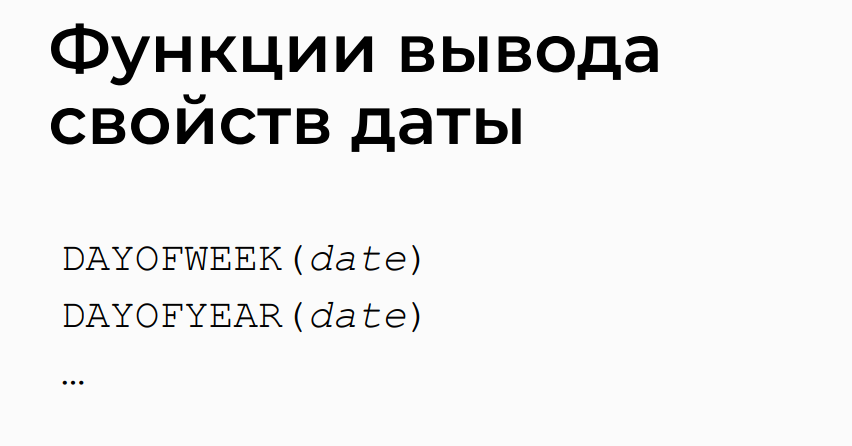

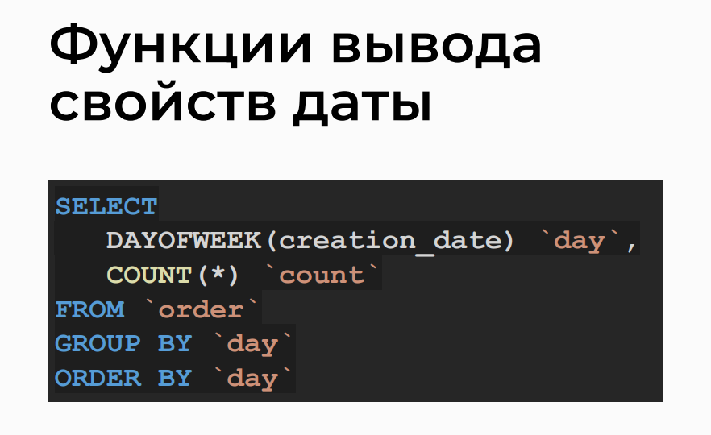

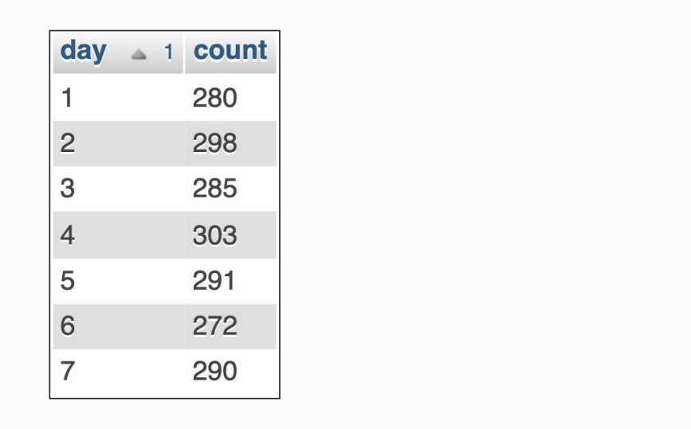

## Getting Current Date and Time


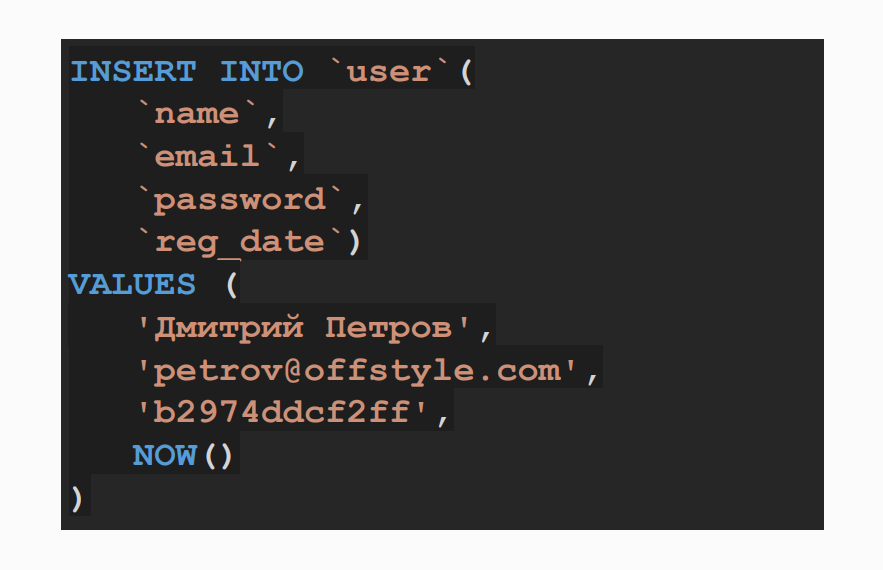

## Difference Between Two Dates
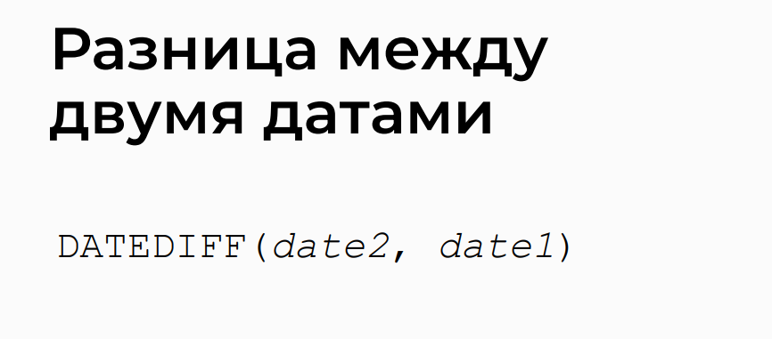

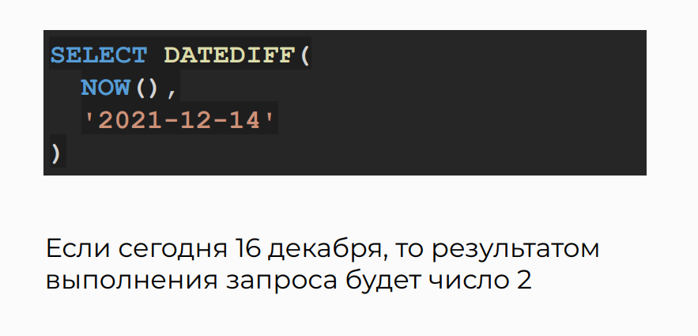

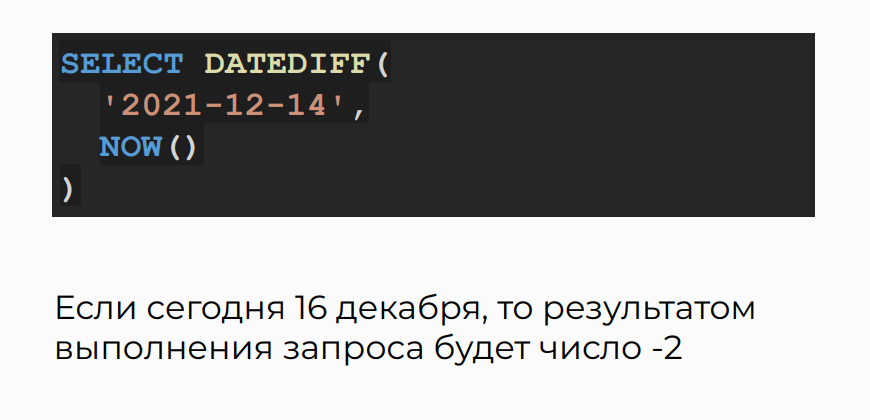

## Working with Timestamp
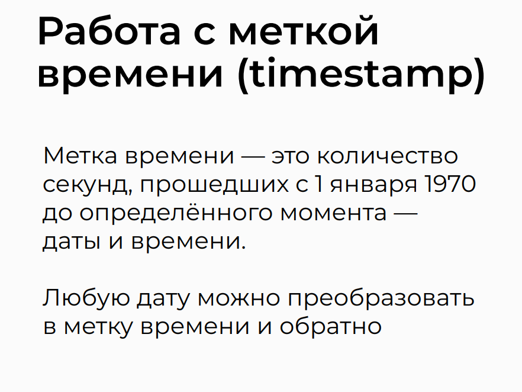

## Timestamp Functions
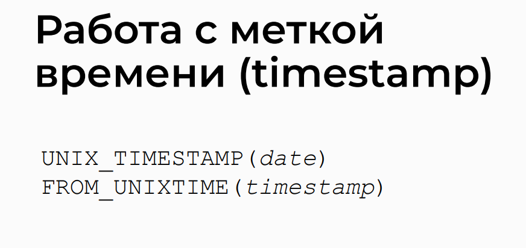


## Practice on the topic 

> In this task, you need to execute a query on the mindbox.sql database to retrieve information about overdue orders.
> The query should select the following fields from the order table:

>- Order ID (id).
>- User ID (user_id).
>- Status ID (status_id) in ascending order.
>- Creation date in descending order (creation_date).
>- The field `label`.

> Conditions for the `label` field:

>- If the order is older than one year and status_id is 7 or 8, the `label` field should display "Old".
>- If the order is older than one year and in other statuses, the `label` field should display "Outdated".
>- If the order is less than one year old in all statuses, the `label` field should display "New".

> Comment: It is necessary to write a condition based on the difference between the current date and the date field in the orders table.
> If the difference is more than a year, then it is necessary to check the status and make a verdict based on it. If the difference is less than a year, then the order is considered new.

> Request using IF:

```sql
SELECT
    `id`,
    `user_id`,
    `status_id`,
    `creation_date`,
    IF (
        DATEDIFF(CURDATE(), `creation_date`) / 365 > 1,
        IF (`status_id` in (7, 8), 'Старый', 'Устаревший'),
        'Новый'
    ) `label`
FROM `order`
ORDER BY `status_id`, `creation_date` DESC;
```

```sql
SELECT
  id AS 'Order ID',
  user_id AS 'User ID',
  status_id AS 'Status ID',
  creation_date AS 'Creation Date',
  IF (
    DATEDIFF(CURDATE(), creation_date) / 365 > 1,
    IF (status_id IN (7, 8), 'Old', 'Outdated'),
    'New'
  ) AS 'Label'
FROM
  `order`
ORDER BY
  status_id ASC,
  creation_date DESC;

```

> Request using CASE:

```sql
SELECT
    `id`,
    `user_id`,
    `status_id`,
    `creation_date`,
    CASE
        WHEN DATEDIFF(CURDATE(), `creation_date`) / 365 <= 1 THEN 'Новый'
        WHEN `status_id` in (7, 8) THEN 'Старый'
        ELSE 'Устаревший'
    END `label`
FROM `order`
ORDER BY `status_id`, `creation_date` DESC;

```

```sql
SELECT
  id AS 'Order ID',
  user_id AS 'User ID',
  status_id AS 'Status ID',
  creation_date AS 'Creation Date',
  CASE
    WHEN DATEDIFF(CURDATE(), `creation_date`) / 365 <= 1 THEN 'New'
    WHEN `status_id` in (7, 8) THEN 'Old'
    ELSE 'Outdated'
  END AS 'label'
FROM
  `order`
ORDER BY
  status_id ASC,
  creation_date DESC;

```

