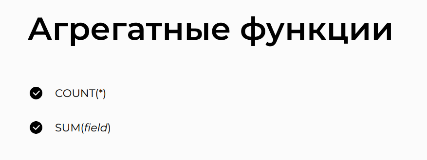

# Aggregate Functions

## Topic


## COUNT(*) Function


## Application of Queries with COUNT(*) Function


## SUM(field) Function


## Application of Queries with SUM(field) Function


## MIN(field) and MAX(field) Functions


## Application of Queries with MIN(field) and MAX(field)


## AVG(field) Function


## phpMyAdmin

>- Selects the count of all records from the 'good' table
```sql
SELECT COUNT(*) 
FROM `good` 
WHERE 1;
```

>- Selects the count of distinct values in the 'name' column from the 'good' table
```sql
SELECT COUNT(DISTINCT name) 
FROM `good` 
WHERE 1;
```

>- Selects the sum of values in the 'count' column from the 'good' table
```sql
SELECT SUM(`count`) 
FROM `good`;
```

>- Selects the sum of a conditional expression based on the 'count' column from the 'good' table
```sql
SELECT SUM(
    IF(`count` < 50, 1, 0)
) 
FROM `good`;
```

