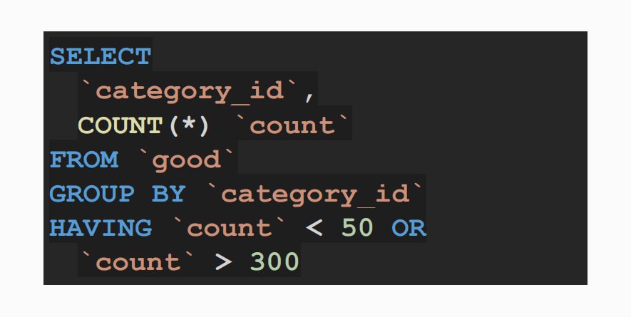

# Grouping and Filtering, HAVING Operator

## Topic


## Grouping


## HAVING Operator


## Practical Application of the HAVING Operator




## Practice on the topic

> 1. Retrieve statistics for each duplicate product: its name, repetition count, minimum quantity, average quantity, and maximum quantity.

```sql
SELECT
    `name`,
    COUNT(*) `repeat_count`,
    MIN(`count`) `min_count`,
    AVG(`count`) `avg_count`,
    MAX(`count`) `max_count`
FROM `good`
GROUP BY `name`
HAVING `repeat_count` > 1;
```

```sql
SELECT
    `name`,
    COUNT(*) AS `repeat_count`,
    MIN(`count`) AS `min_count`,
    AVG(`count`) AS `avg_count`,
    MAX(`count`) AS `max_count`
FROM
    `good`
GROUP BY
    `name`
HAVING
    `repeat_count` > 1;

```
> 2. Display the name, email, total spending, and average quantity of ordered items for users who:
> - Spent more than 1000 rubles in total,
> - Have an email address with a domain from the United Kingdom,
> - Made more than one order.

```sql
SELECT
    u.`name`,
    u.`email`,
    SUM(o2g.`count` * g.`price`) `total_spent`,
    AVG(o2g.`count`) `avg_goods_cnt`
FROM `user` u
JOIN `order` o ON
    o.user_id = u.id
JOIN `order2good` o2g ON
    o2g.order_id = o.id
JOIN `good` g ON
    g.id = o2g.good_id
GROUP BY o.user_id
HAVING
    `total_spent` > 1000 AND
    u.`email` LIKE '%.uk' AND
    COUNT(DISTINCT o.id) > 1;
```

```sql
SELECT
    u.`name`,
    u.`email`,
    SUM(o2g.`count` * g.`price`) AS `total_spent`,
    AVG(o2g.`count`) AS `avg_goods_cnt`
FROM
    `user` u
JOIN
    `order` o ON o.user_id = u.id
JOIN
    `order2good` o2g ON o2g.order_id = o.id
JOIN
    `good` g ON g.id = o2g.good_id
GROUP BY
    o.user_id
HAVING
    `total_spent` > 1000 AND
    u.`email` LIKE '%.uk' AND
    COUNT(DISTINCT o.id) > 1;

```
