# Query Execution Speed, Indexing

## Topic

## Factors Affecting Query Execution Speed

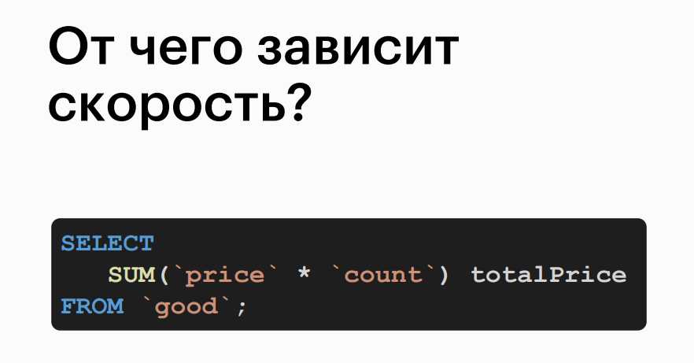

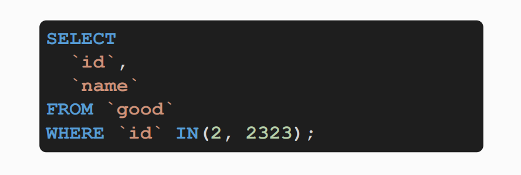

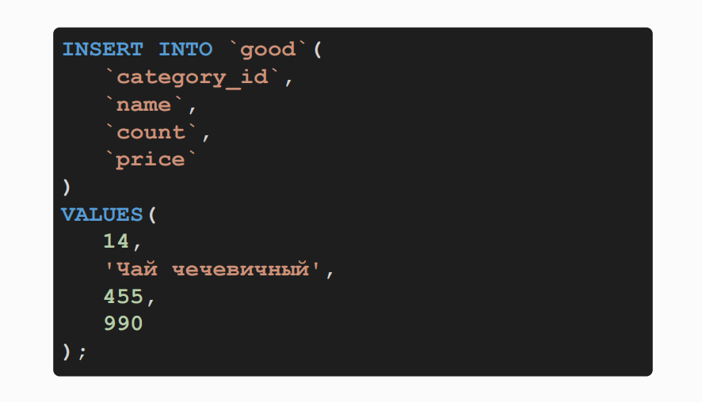

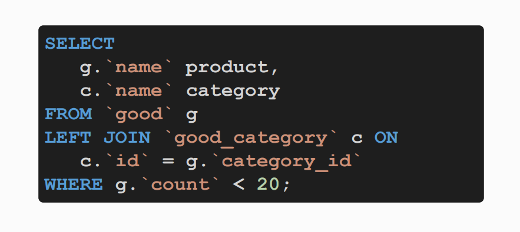

## How Table Search Works

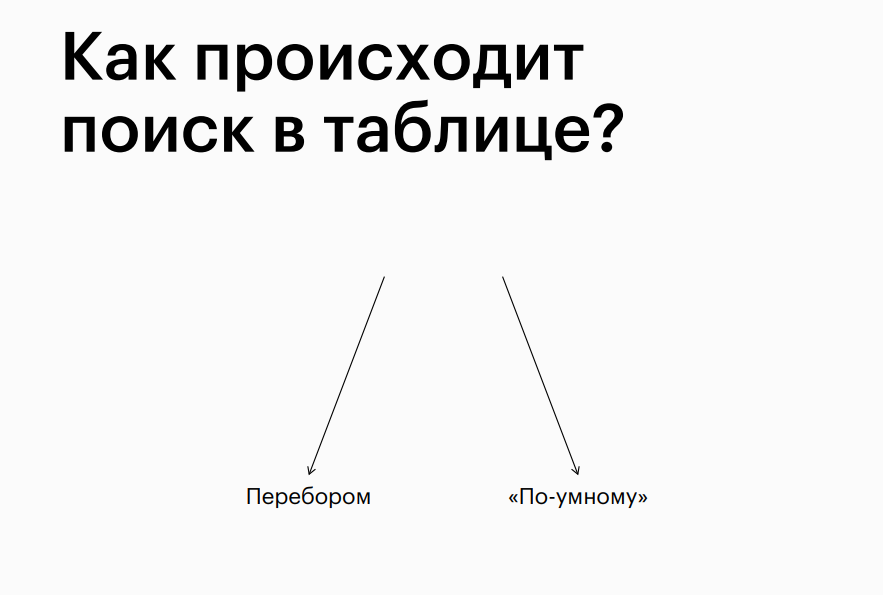

## Smart (Binary) Search

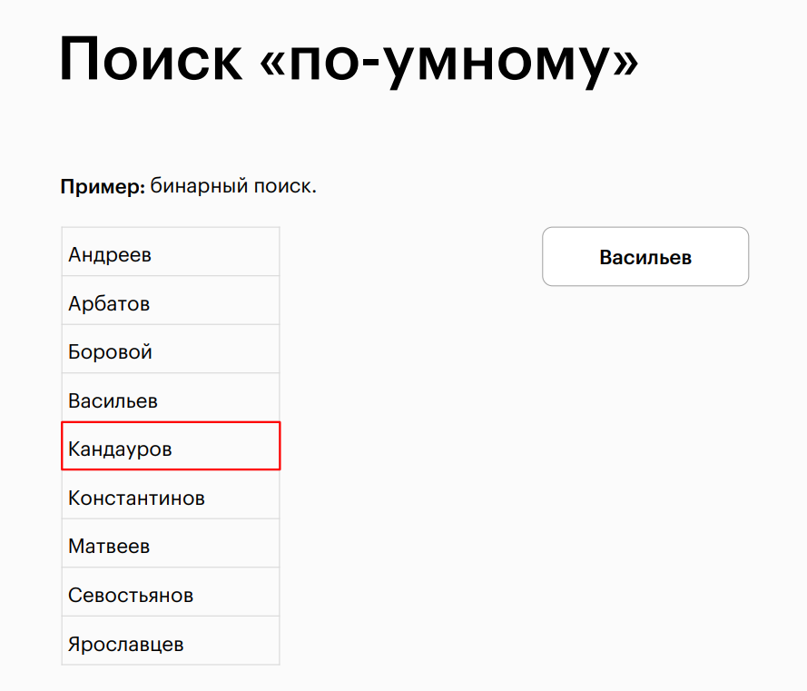

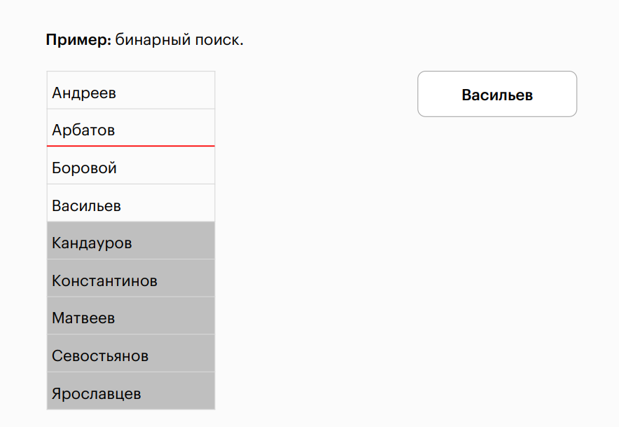

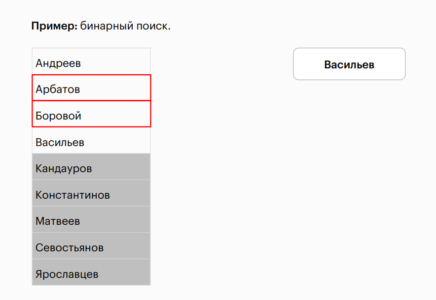

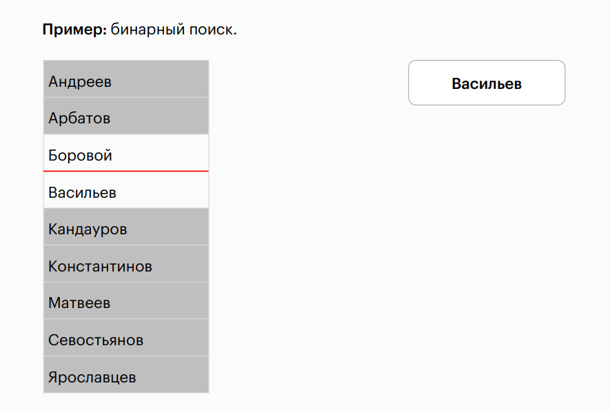

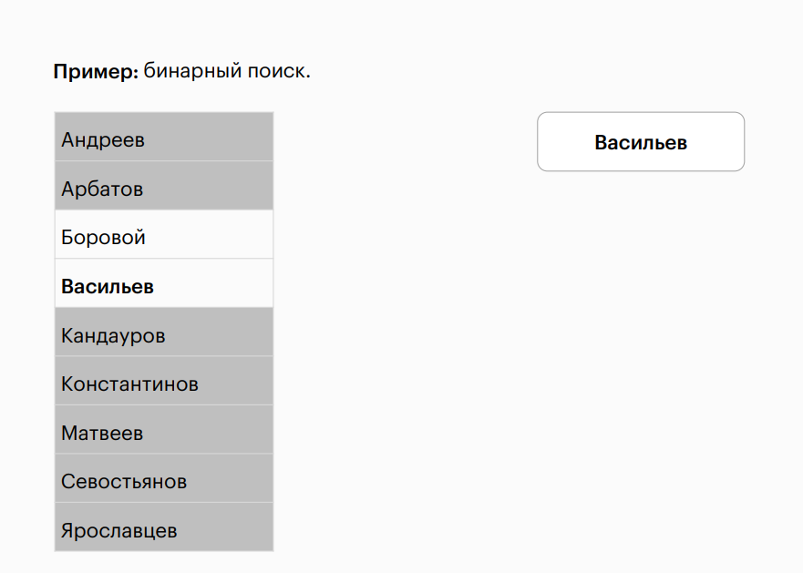

## Binary Search Speed

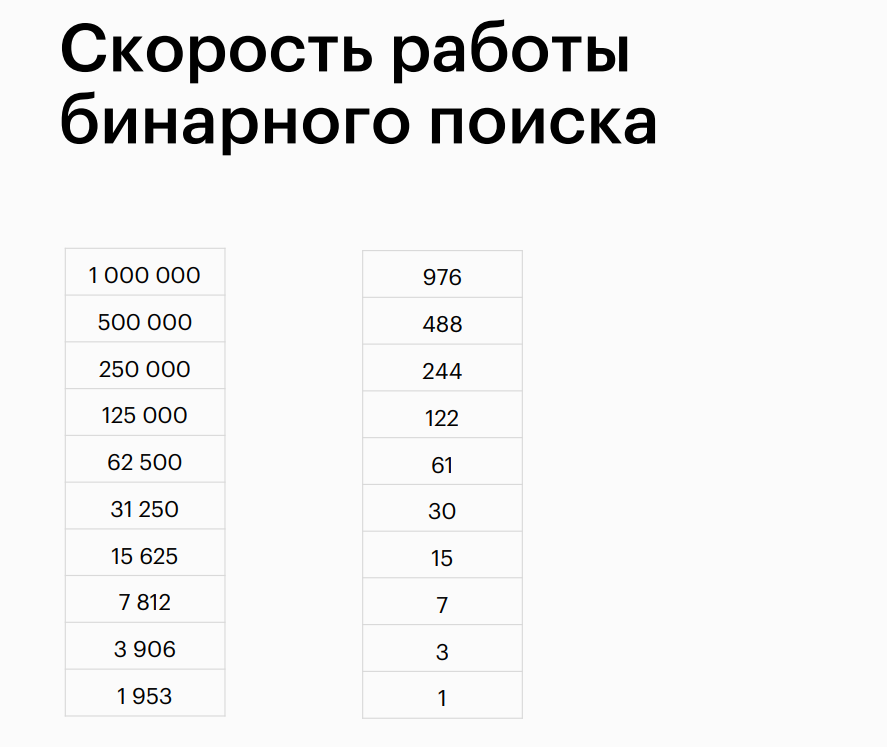

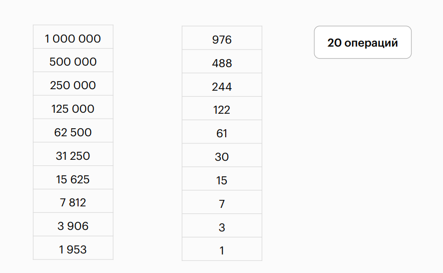

## Types of Indexes in MySQL

## Installing Indexes

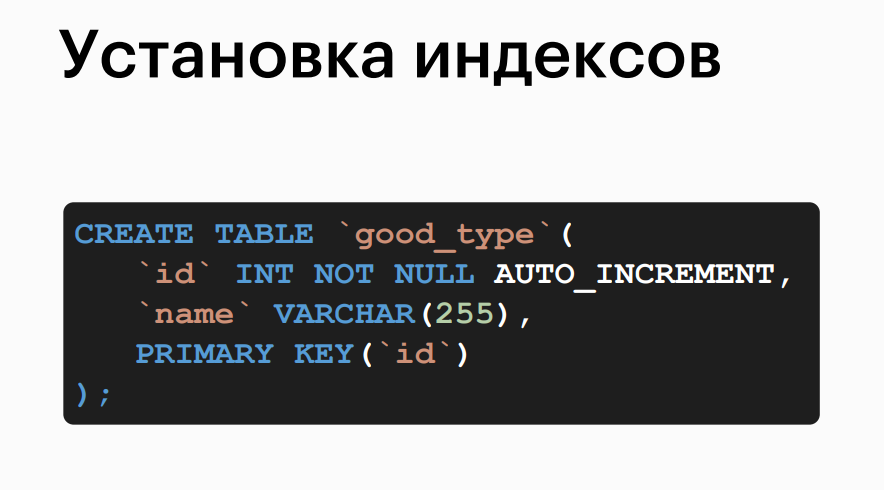

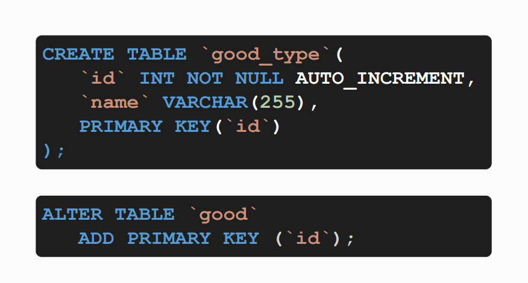

## Types of Indexes (Keys)

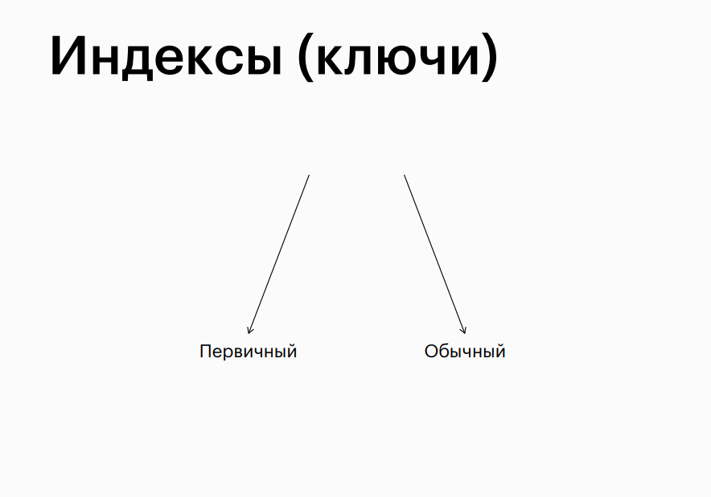

## Differences Between UNIQUE and PRIMARY KEY

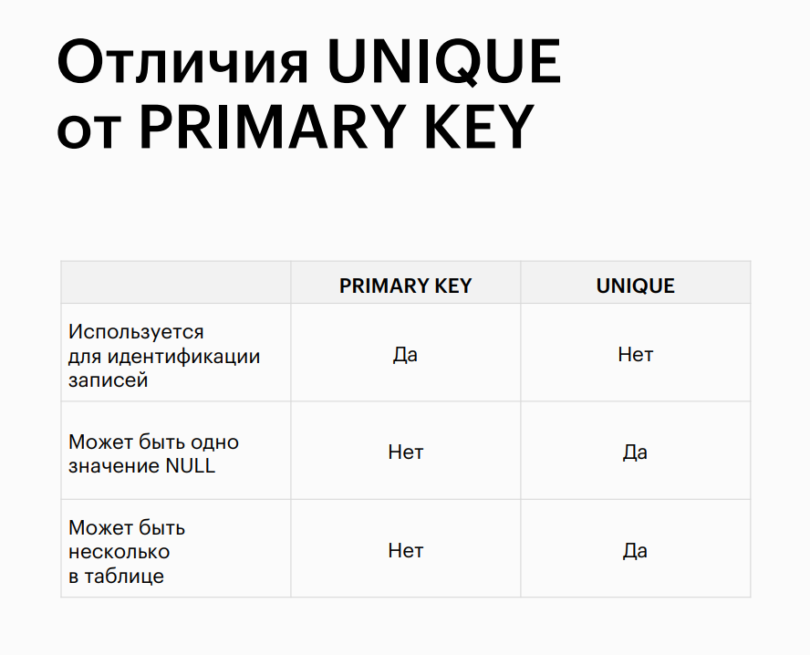

## Indexes

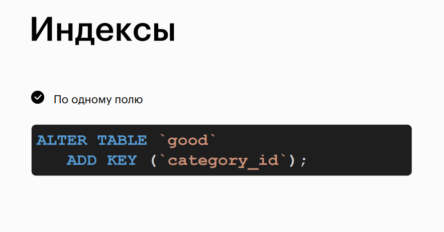

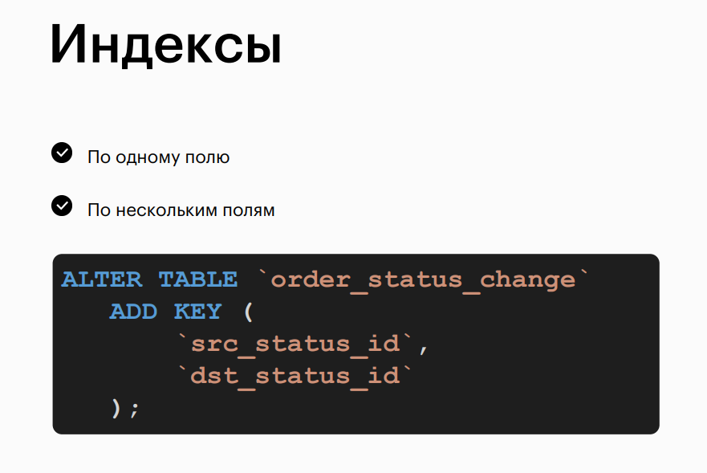

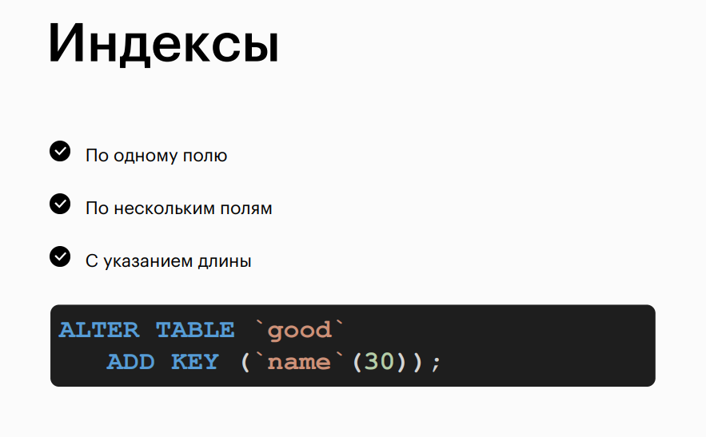
