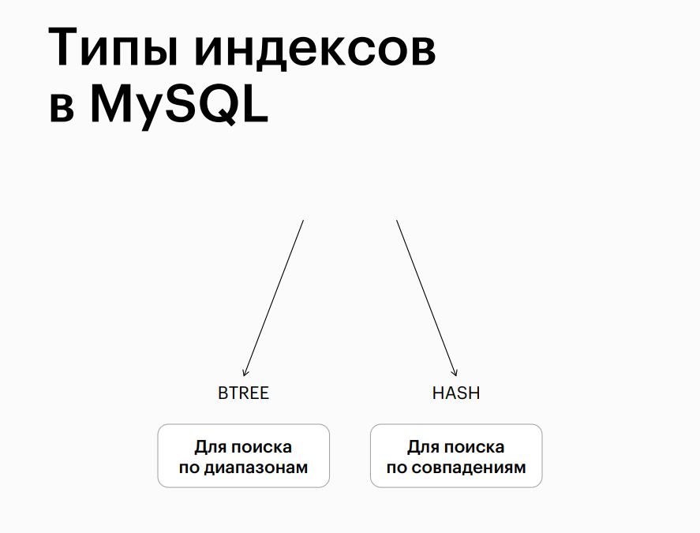
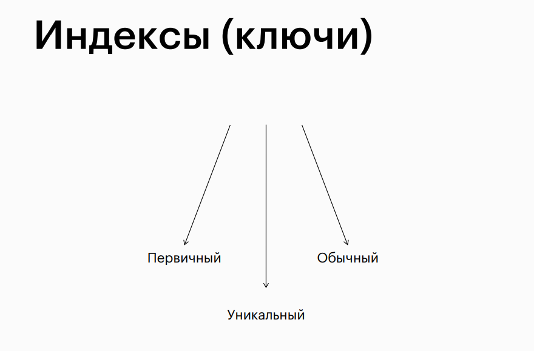

# Query Execution Speed, Indexing

## Topic

## Factors Affecting Query Execution Speed

## How Table Search Works

## Smart (Binary) Search

## Binary Search Speed

## Types of Indexes in MySQL

## Installing Indexes

## Types of Indexes (Keys)

## Differences Between UNIQUE and PRIMARY KEY

## Indexes

