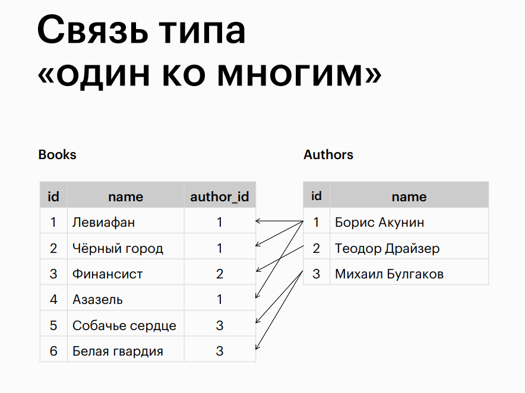

# Relationships, Foreign Keys, and Constraints

## Topic

## Relationship Type "One-to-Many"

## Relationship Type "One-to-One"

## Relationship Type "Many-to-Many"

## Data Integrity Violation

## Establishing "One-to-Many" Relationship

## Establishing "One-to-One" Relationship

## Establishing "Many-to-Many" Relationship

## Naming Keys and Constraints

## Ensuring Data Integrity

## Actions on Data Integrity Violation

