# Nested Queries

## Topic


## Example of a task using nested queries

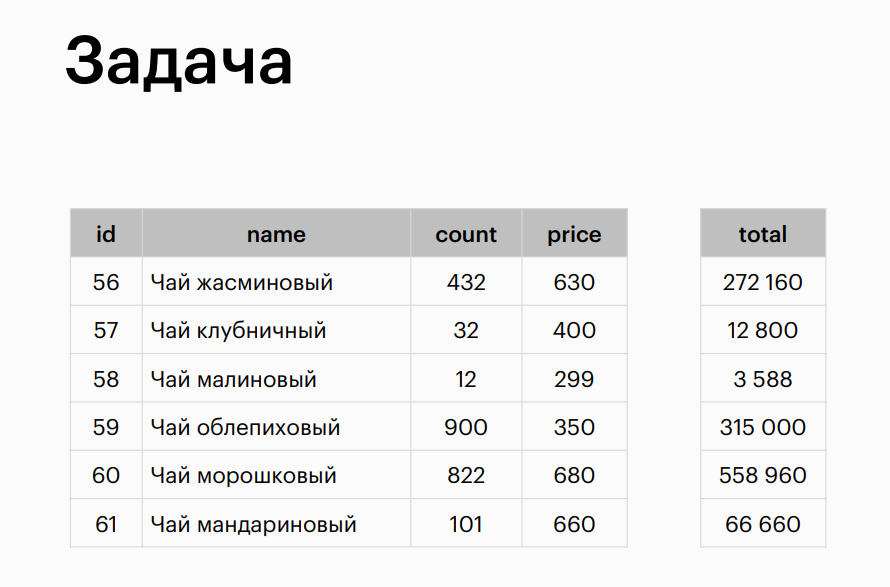

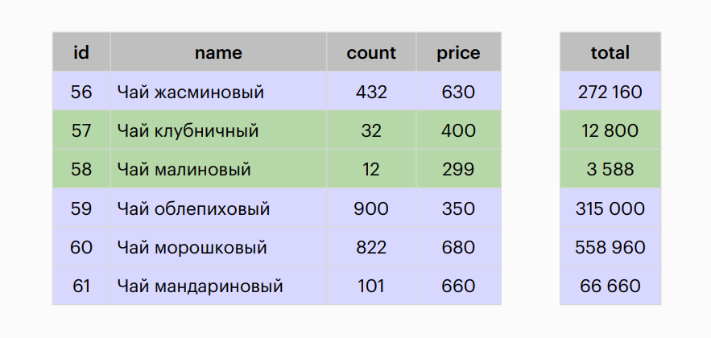

## Step 1: Calculate total costs

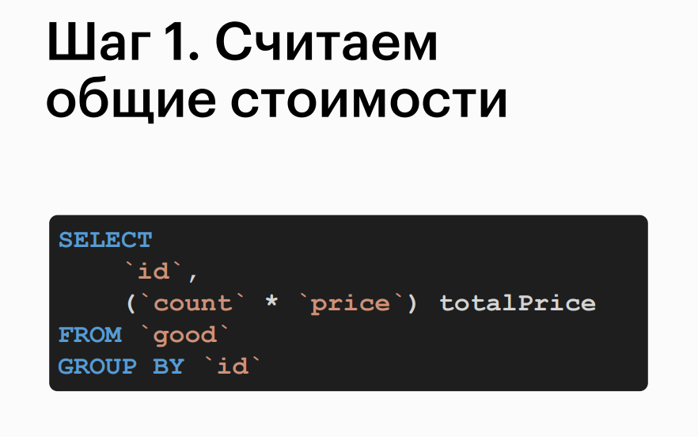

## Step 2: Divide total costs into two groups

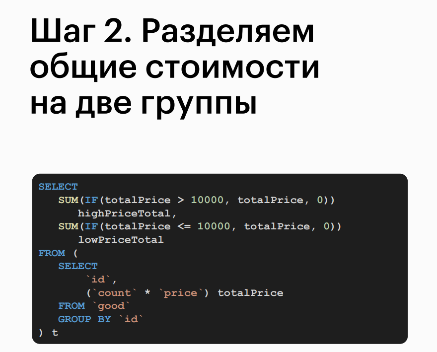

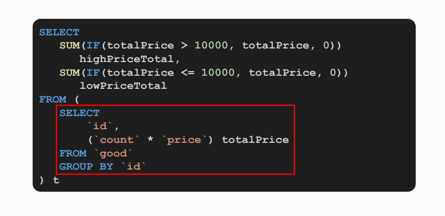

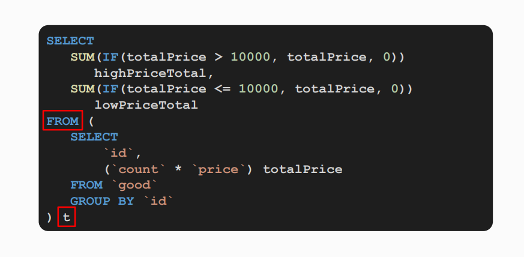

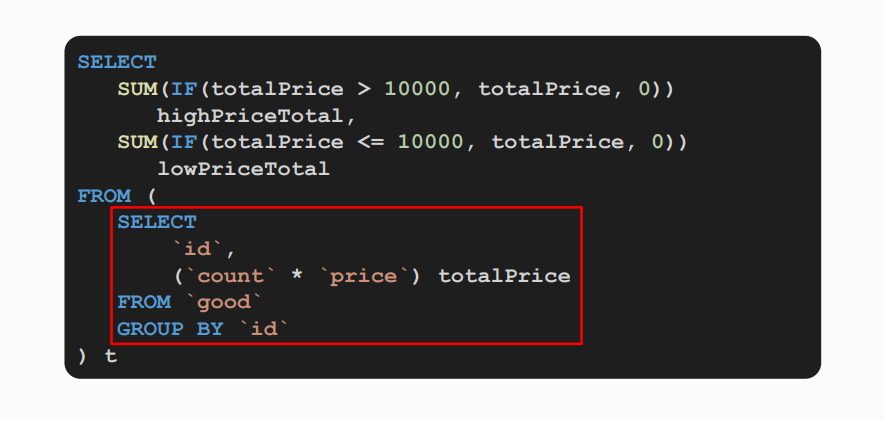

## Nested queries (subqueries) in conditions


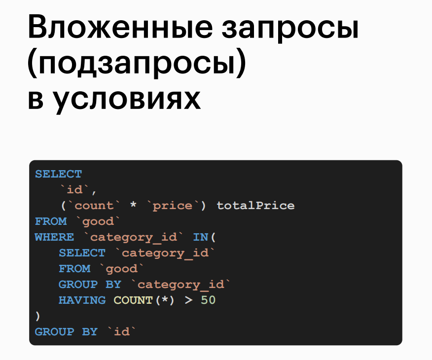

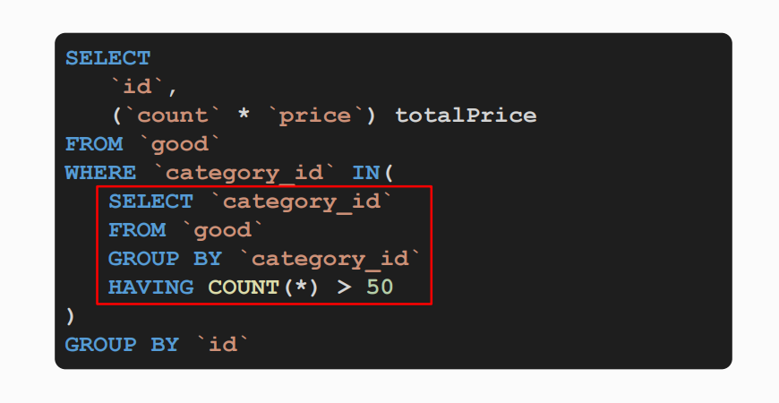

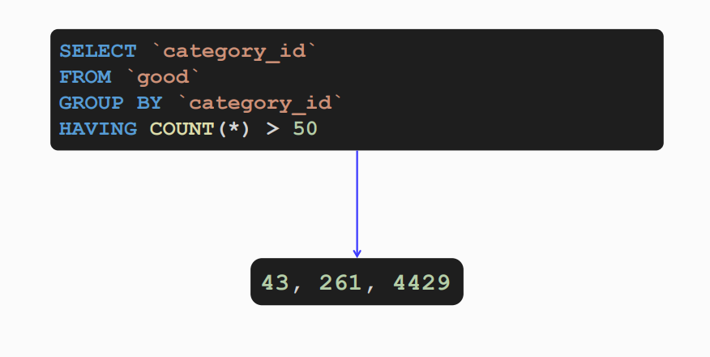

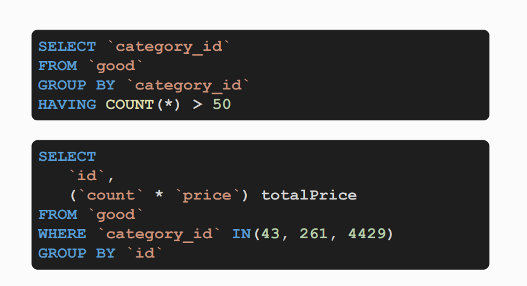

## Practice on the topic

> 1. Using nested queries, retrieve all unique top-level mail domains with a length of three characters.

```sql
SELECT DISTINCT
    `domain`
FROM (
    SELECT
        REPLACE(
            SUBSTR(`email`, -3),
            '.',
            '') `domain`
    FROM `user`
) t
WHERE CHAR_LENGTH(`domain`) = 3;
```

```sql
SELECT DISTINCT
    `domain`
FROM (
    SELECT
        REPLACE(
            SUBSTR(`email`, -3),
            '.',
            '') AS `domain`
    FROM `user`
) AS t
WHERE CHAR_LENGTH(`domain`) = 3;

```

> 2. Using nested queries, display for each product that belongs to a category with an average quantity of products less than 185:
>
>- Category ID
>- Product name
>- Quantity of the product
>- Cost of the product.
>
> Comment: To display information about elements of grouped data, you need to represent the group as a subquery that should be attached to the original table before grouping.
> The task can be solved either using the WHERE clause or using JOIN.

```sql
SELECT g.category_id, g.name, g.count, g.price
FROM `good` g 
JOIN (
    SELECT category_id
    FROM `good`
    GROUP BY category_id
    HAVING AVG(count) < 185
) gg ON
    gg.category_id = g.category_id;
```

```sql
SELECT g.category_id, g.name, g.count, g.price
FROM `good` g
WHERE g.category_id IN (
    SELECT category_id
    FROM `good`
    GROUP BY category_id
    HAVING AVG(count) < 185
)

```
