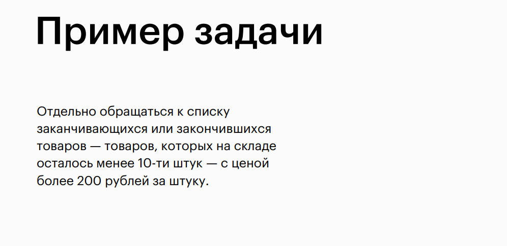
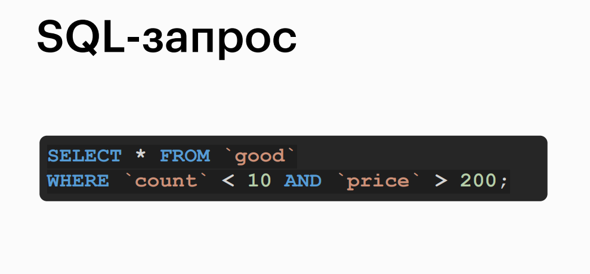
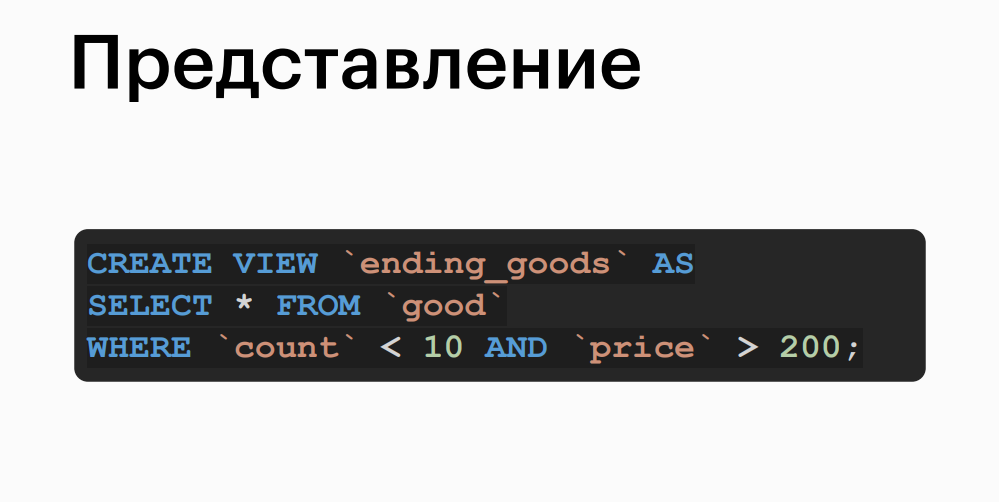
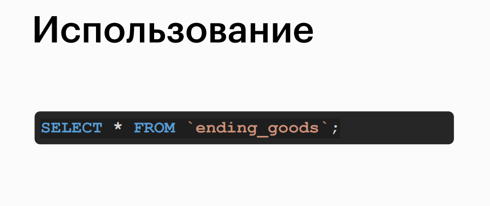
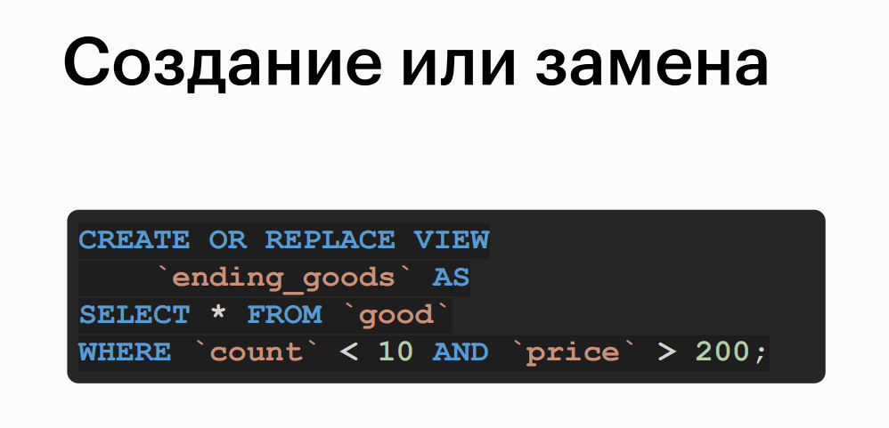

# Views

## Topic


## What are Views


## Example Problem


## SQL Query


## Creating Views


## Using Views


## Creating or Replacing a View


## Deleting a View


## Practice on the topic

> 1. Using views, display all unique top-level email domains with a length of three characters.

```sql
CREATE OR REPLACE VIEW `domains` AS
SELECT
    REPLACE(
        SUBSTR(`email`, -3),
        '.',
        ''
    ) `domain`
FROM `user`;

SELECT DISTINCT `domain`
FROM `domains`
WHERE CHAR_LENGTH(`domain`) = 3;

```

> 2. Retrieve the category ID and its total product cost under the condition that the category has more than 50 items. Utilize views.
> Note: This is a task from the "Nested Queries" video. It is beneficial to study the view separately after its creation to understand what you are dealing with.

```sql
CREATE OR REPLACE VIEW `vast_goods_categories` AS
SELECT `category_id` `id`
FROM `good`
GROUP BY `category_id`
HAVING COUNT(*) > 50;
SELECT
    g.`category_id`,
    SUM(`count` * `price`) total_price
FROM `good` g
JOIN `vast_goods_categories` vgc ON
    vgc.id = g.`category_id`
WHERE g.`category_id` IN(vgc.id)
GROUP BY g.`category_id`;
```

> 3. Create a view with user ID, order ID, and the total cost within a user order that transitioned from "Delivered" status to "Paid" status. Display the contents of the view.
> Note: Group by two fields, as each user can have multiple orders, and each order can contain multiple items.

```sql
CREATE OR REPLACE VIEW `users_orders` AS
SELECT
    u.id user_id,
    o.id order_id,
    SUM(o2g.count * g.price) total_price
FROM `user` u
JOIN `order` o ON
    o.user_id = u.id
JOIN `order2good` o2g ON
    o2g.order_id = o.id
JOIN `good` g ON
    g.id = o2g.good_id
JOIN `order_status_change` osc ON
    osc.order_id = o.id
WHERE
    osc.src_status_id = 6 AND
    osc.dst_status_id = 7
GROUP BY u.id, o.id;
```

> 4. Using the view obtained in the previous task, display:
> - User ID
> - A string with all the items that the user had in the order with the maximum total cost. Display the items, separating them with commas. Place a space only after the comma.
> - ID of that order
> - The total cost. If there are multiple orders with the same cost, do not consider that user.
> Note: To utilize the maximum cost order for each user, a subquery needs to be executed to join the view with itself. Then, tables are joined to retrieve the item names.
> To eliminate duplicate orders with the same cost, a filter is applied to the group.

```sql
SELECT
    uo.user_id,
    uo.order_id,
    GROUP_CONCAT(TRIM(g.name) SEPARATOR ', ') `goods`,
    max_order_price order_price
FROM `users_orders` uo
JOIN (
    SELECT uoi.user_id, MAX(uoi.total_price) `max_order_price`
    FROM `users_orders` uoi
    GROUP BY uo.user_id, uo.order_id
) muo ON
    muo.user_id = uo.user_id AND `max_order_price` = uo.total_price
JOIN `order` o ON
    o.id = uo.order_id
JOIN `order2good` o2g ON
    o2g.order_id = o.id
JOIN `good` g ON
    g.id = o2g.good_id
GROUP BY uo.user_id, uo.order_id
HAVING COUNT(DISTINCT uo.order_id) = 1;
```

