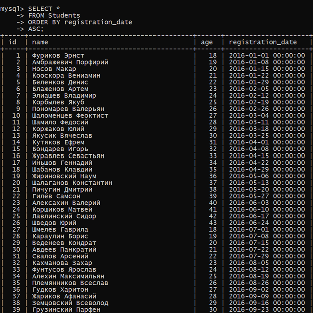
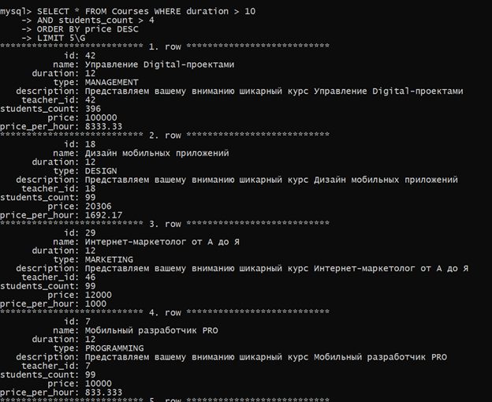
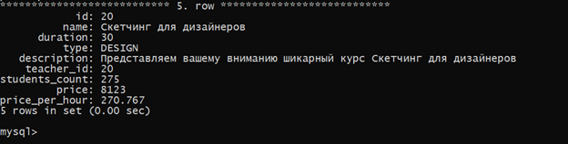
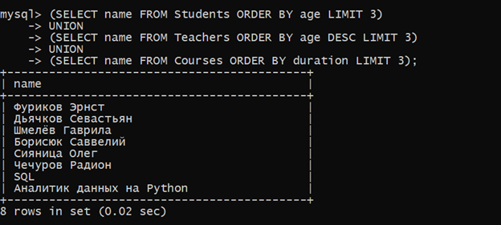
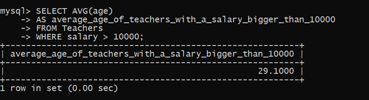
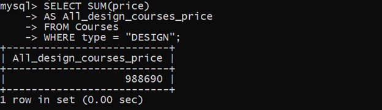
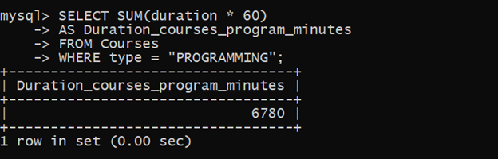
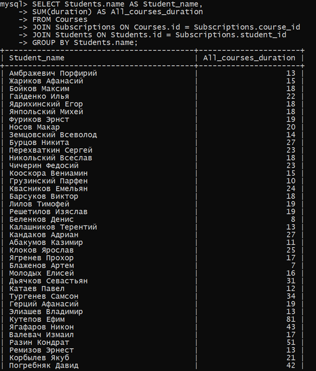
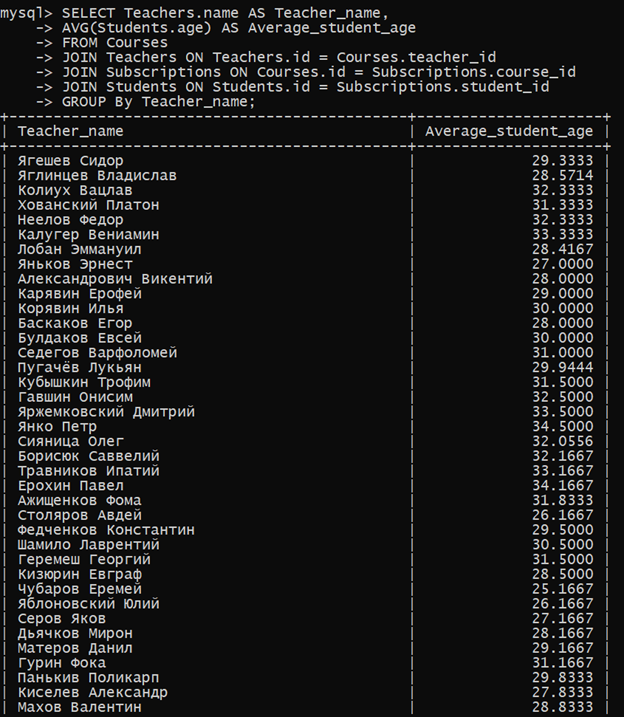
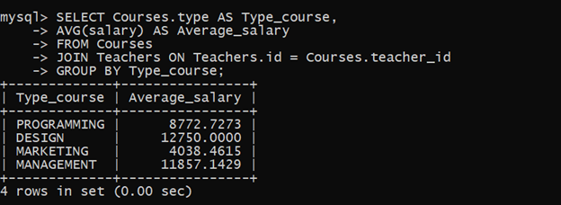

# Homeworks

## `Homework 1` - Data selection and filtering, SELECT query
### 1. Write a request to select students in the order of their registration

### 2. Write a request to select the 5 most expensive courses, which have more than 4 students, and which last more than 10 hours.

### 3. Write one (!) query that will simultaneously display a list of the names of the three youngest students, the names of the three oldest teachers and the names of the three longest courses.

## `Homework 2` - Functions and expressions, data aggregation
### 1. Write a request to select the average age of all teachers with a salary of more than 10,000.

### 2. Write a request to calculate the amount of how much it will cost to buy all design courses.

### 3. Write a query to calculate how many minutes (!) all programming courses last.

## `Homework 3` - Grouping, joining tables (JOIN)
### 1. Write a request that outputs the amount of how many hours each student should eventually study (the sum of the duration of all courses for which he is subscribed). As a result, the query returns two columns: The Student's name — The number of hours.

### 2. Write a query that will calculate for each teacher the average age of his students. As a result, the query returns two columns: The name of the Teacher — The Average Age of the Students.

### 3. Write a query that outputs the average teacher salary for each type of course (Design/Programming/Marketing, etc.). As a result, the query returns two columns: The type of Course is the Average salary.

