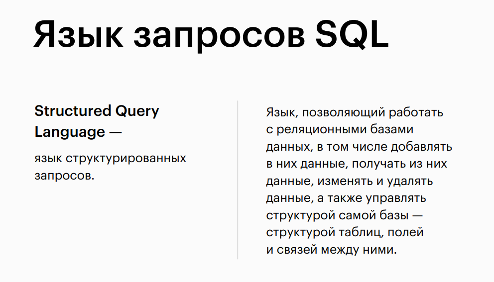
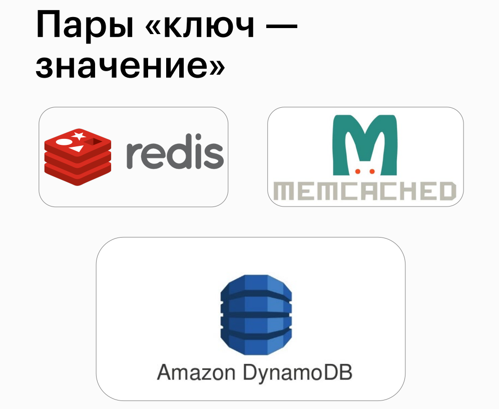
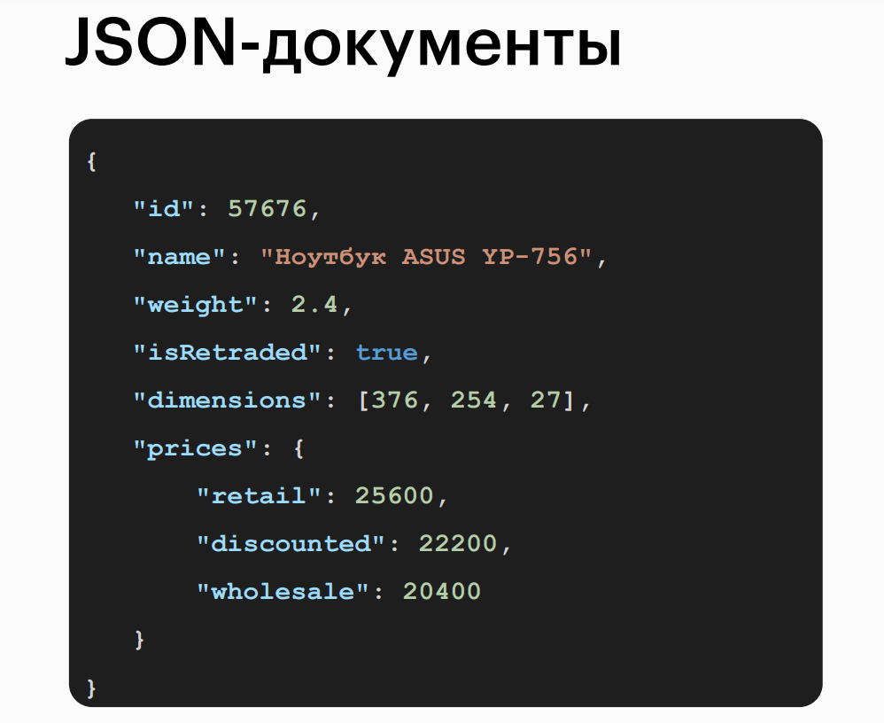
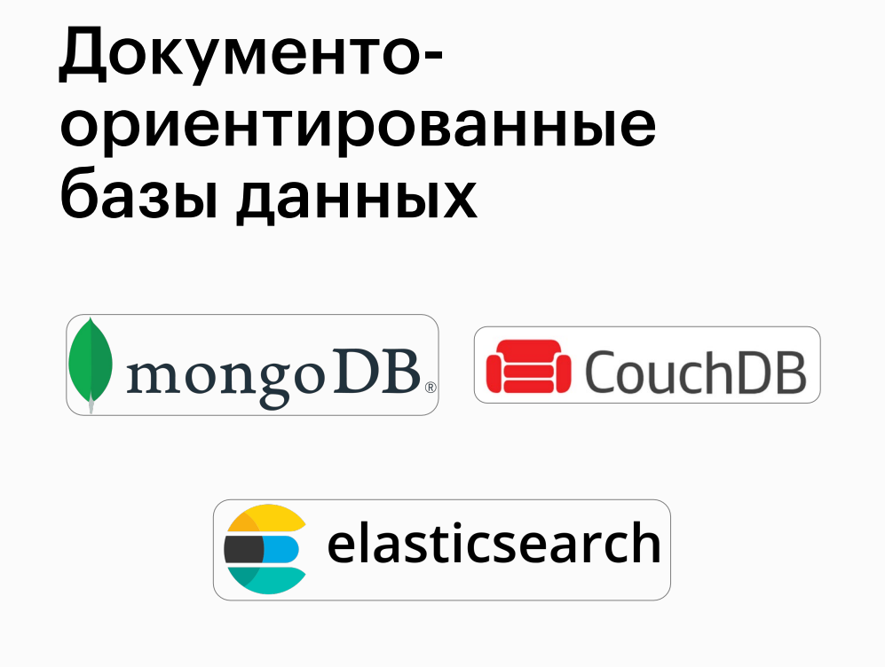

# SQL Structured Query Language

## Relational and non-relational databases

## Database

## Database

## Relational databases

## Example: an online bookstore

## Example: an online bookstore

## Problems

## Example: an online bookstore

## Terminology

## SQL Query Language

## Relational databases

## Non-relational databases (NoSQL)

